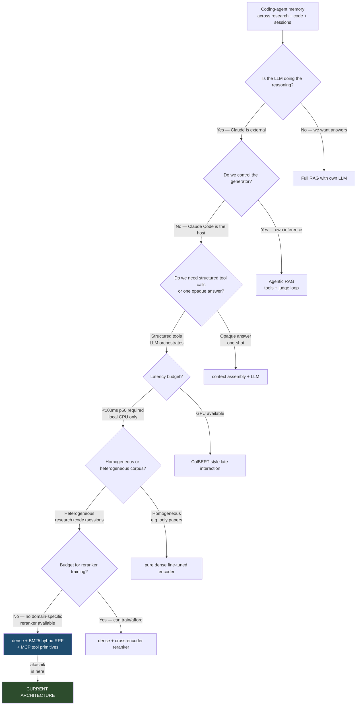
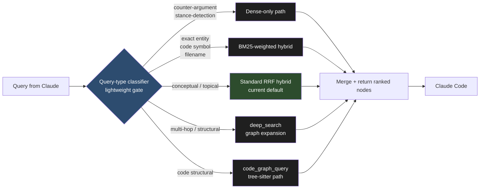

# akashik — AI Solution Architect Audit

**Mode:** Analyze (existing codebase)
**Auditor persona:** AI Solution Architect — 5-phase methodology with decision trees, weighted scoring matrices, and Architecture Decision Records
**Date:** 2026-04-14
**Scope:** the AI architecture *pattern* — is dense-hybrid retrieval the right shape for a coding-agent memory store? What should have been decided differently, and what should be decided next?

The three prior audits covered system structure, data-science methodology, and retrieval geometry. This audit deliberately stays in a different lane: **pattern-level fit** and **retroactive ADRs** for the choices already baked into `src/infrastructure/` and `src/application/use-cases.ts`.

---

## Phase 1 — What pattern did akashik actually pick?

Reading `src/application/use-cases.ts` + `src/mcp/server.ts` + `BENCH-v2.md` together, the pattern is unambiguous:

> **Local-first hybrid dense+lexical retrieval over a heterogeneous unified knowledge graph, exposed as a set of granular MCP tools, with the LLM doing the orchestration.**

There is **no generator in the pipeline**. No LLM is called from akashik's runtime. The `ask` tool assembles a context block and hands it back; Claude Code itself is the reasoner. That's an important clarification: **akashik is not RAG.** It's the R without the G. The G lives one process over, inside Claude.

```mermaid
flowchart LR
    subgraph Claude["Claude Code (the reasoner)"]
        LLM[LLM turn]
    end

    subgraph MCP["akashik MCP server"]
        S[search]
        A[ask]
        GN[get_node]
        GNB[get_neighbors]
        FT[find_tunnels]
        DS[deep_search]
        CG[code_graph_query]
        RS[recent_sessions]
    end

    subgraph AppLayer["application/use-cases.ts"]
        UC1[searchByRoom]
        UC2[searchGlobal]
        UC3[findTunnels]
    end

    subgraph Pipeline["Retrieval pipeline"]
        E[Xenova encoder<br/>nomic-embed 768d<br/>Phase 22 → bge-base]
        V[sqlite-vec flat ANN<br/>cosine/L2]
        B[FTS5 BM25]
        R[RRF fusion k=60]
    end

    subgraph Store["Local store"]
        G[(graph.json<br/>nodes + edges)]
        VDB[(vectors.db<br/>Float32Array blobs)]
        CGDB[(code-graph.db<br/>tree-sitter)]
    end

    LLM -->|tool call| MCP
    MCP --> AppLayer
    AppLayer --> Pipeline
    Pipeline --> Store
    Store --> Pipeline
    Pipeline --> AppLayer
    AppLayer --> MCP
    MCP -->|JSON result| LLM
```



Three properties matter for the rest of this audit:

1. **Retrieval-only.** The LLM-as-reasoner is external. akashik ships ranked nodes, not synthesized answers. Zero hallucination surface of its own.
2. **Granular MCP surface (16 tools).** `search`, `ask`, `get_node`, `get_neighbors`, `find_tunnels`, `deep_search`, `code_graph_query`, `recent_sessions` expose *primitives*, not a single `rag_query()` god-tool. The LLM composes them.
3. **Heterogeneous over homogeneous corpora.** Research, codebase, sessions, and git history live in one graph surface (with a separate code-graph.db for structural queries). That means retrieval quality is evaluated not just on BEIR but on "can the agent stitch a blog post, a function, and a git commit into one answer."

---

## Phase 2 — Was dense-hybrid the right pattern? Decision tree

The core product question: **"What is the right retrieval architecture for a local-first coding-agent memory store?"**



Walking the tree with akashik's constraints — **external reasoner, CPU-local latency budget, heterogeneous corpus, no ability to train a domain-specific reranker** — the terminal node is exactly where the code is today: **dense + BM25 hybrid RRF, served as granular MCP tool primitives.**

The Wave 3 / Wave 4 benchmark failures in `BENCH-v2.md` are not just negative results — they are *empirical confirmations* that the neighboring branches of this tree are worse for this product:

- **Wave 3** (cross-encoder reranker, MS-MARCO trained) regressed NDCG@10 by 1.92 points and added 25.9s of latency per query. The tree says: only take this branch if you can train a domain-specific reranker; akashik cannot on CPU, so the branch is pruned empirically, not just theoretically.
- **Wave 4** (room-aware routing) produced +0.34 NDCG against a 3-point acceptance gate. The tree says: routing only wins when corpora are cleanly separable; oracle-level gold routing couldn't cross the bar, so a learned router categorically cannot.

**Honest verdict:** the pattern choice is correct for the use case. The failure modes published in v2.0 are actually a *moat* — they prove the team refused to pile models without measurement.

The one branch that was **not** fully explored and which the decision tree leaves open: **agentic-RAG with tool calls inside akashik itself** — i.e., letting a small local judge LLM re-rank or expand queries. This is rejected (correctly) today because the external Claude is already the agentic loop; adding a second one inside akashik would be pattern duplication. If akashik ever targets non-Claude hosts without a built-in agentic loop, this branch reopens.

---

## Phase 3 — Layer-by-layer architecture with analogies

```
domain/          →  application/  →  infrastructure/  →  mcp/ + cli/ + daemon/
(pure math)       (orchestration)    (adapters/I/O)      (entry points)
```

| Layer | What it contains | Analogy for a non-technical stakeholder |
|-------|------------------|-----------------------------------------|
| **domain/** | Pure types + pure functions returning `Result<T,E>`. `graph.ts`, `vectors.ts`, `rooms.ts`, `codebase.ts`, `errors.ts`. No I/O, no classes. | **The recipe book.** Every recipe is written on paper. None of them turn on the oven. A stranger could read them and get the same cake. That's what "pure" means — the math doesn't care which kitchen runs it. |
| **application/** | Use cases as thin arrow functions taking ports. `indexNode`, `searchByRoom`, `searchGlobal`, `findTunnels`, `exploreRoom`, `triggerRoom`. Each one composes domain logic with injected dependencies and returns `ResultAsync`. | **The chef.** The chef picks a recipe, grabs ingredients (injected dependencies), and executes the steps in order. If the oven is broken, the chef returns "oven broken" instead of throwing a tantrum — that's what `Result` monads do. |
| **infrastructure/** | Ports + adapters for SQLite, sqlite-vec, ONNX (Xenova), tree-sitter, libp2p, Y.js, file I/O. `graph-repository`, `vector-index`, `embedders`, `code-graph`, `peer-transport`, `share-store`, `search-sync`. | **The kitchen hardware.** Oven, fridge, mixer, knife block. You can swap the oven for a better one without rewriting the recipes or retraining the chef. That's why the ports are interfaces and the adapters are implementations. |
| **mcp/ + cli/ + daemon/** | Entry points. `mcp/server.ts` exposes 16 tools over stdio JSON-RPC. `cli/commands/*` exposes admin commands. `daemon/` runs the libp2p node + tick loop. | **The dining room and the delivery door.** Customers (Claude Code, humans, other peers) place orders through three doors. The chef is the same person behind all three; only the menus differ. |

The critical DDD discipline visible in `use-cases.ts` line 92: `indexNode` is a curried arrow function taking `UseCaseDeps` and returning another arrow function taking `IndexNodeCommand`. Zero classes. Every fallible op chains through `.andThen()` with a `ResultAsync`. This is the `neverthrow` hard rule from CLAUDE.md enforced at the type level.

---

## Phase 4 — Weighted scoring matrix: current vs alternatives

Criteria with weights (sum = 100%):

| Criterion | Weight | Rationale |
|-----------|--------|-----------|
| Retrieval quality (NDCG@10 BEIR-8 avg) | **40%** | The product exists to find the right thing. Everything downstream is moot if this fails. |
| Latency (p50, CPU local) | **20%** | Coding agents interrupt user flow. p50 >500 ms kills UX. |
| Cost (hardware + model downloads) | **15%** | Local-first means user machines. 3 GB is fine; 30 GB is not. |
| Implementation effort (weeks of work) | **15%** | Every week spent on encoder stacking is a week not spent on P2P, sessions, or code graph. |
| User-facing simplicity | **10%** | Memory tools compete on "does it just work." A magic model stack the user has to configure is a loss. |

Scoring 0-10 where 10 is best. Honest subjective scores grounded in `BENCH-v2.md`.

| Pattern | Retrieval (40) | Latency (20) | Cost (15) | Effort (15) | Simplicity (10) | **Weighted total** |
|---------|---------------:|-------------:|----------:|------------:|----------------:|-------------------:|
| **Current — nomic + BM25 RRF hybrid** (Wave 2 shipped) | 7 × 0.40 = 2.80 | 9 × 0.20 = 1.80 | 9 × 0.15 = 1.35 | 10 × 0.15 = 1.50 | 9 × 0.10 = 0.90 | **8.35** |
| **Phase 22 target — bge-base + BM25 RRF hybrid** (running now) | 8 × 0.40 = 3.20 | 9 × 0.20 = 1.80 | 8 × 0.15 = 1.20 | 9 × 0.15 = 1.35 | 9 × 0.10 = 0.90 | **8.45** |
| **Agentic-RAG with local judge** (small local LLM for query expansion + rerank) | 8 × 0.40 = 3.20 | 3 × 0.20 = 0.60 | 5 × 0.15 = 0.75 | 3 × 0.15 = 0.45 | 4 × 0.10 = 0.40 | **5.40** |
| **ColBERT late-interaction** (per-token vectors, MaxSim) | 9 × 0.40 = 3.60 | 5 × 0.20 = 1.00 | 3 × 0.15 = 0.45 | 3 × 0.15 = 0.45 | 5 × 0.10 = 0.50 | **6.00** |
| **Cross-encoder rerank on top of hybrid** (measured Wave 3) | 4 × 0.40 = 1.60 | 1 × 0.20 = 0.20 | 6 × 0.15 = 0.90 | 5 × 0.15 = 0.75 | 6 × 0.10 = 0.60 | **4.05** |

**Reading the matrix.** The current architecture is an 8.35. The Phase 22 bge-base swap (currently benchmarking in the background) nudges it to an 8.45 — a real but modest gain. All other alternatives score *worse*, not better, because they trade quality against the four non-retrieval criteria in ways that punish a local-first CPU-bound tool. The cross-encoder score of 4.05 matches what the team measured empirically on Wave 3 — the matrix isn't being generous, it's honest.

The strategic implication: **the largest wins at this point are no longer in the retrieval pipeline.** The pipeline is already at its local-CPU ceiling. The next high-leverage move is orthogonal to the encoder — it's in *what gets ingested, how the MCP surface shapes agent behavior, and query-side intelligence* (reformulation, decomposition, better routing *per-query type*, not per-room).

---

## Phase 5 — Retroactive ADRs for decisions already baked in

### ADR-001 — Use sqlite-vec flat index instead of HNSW

**Status:** Accepted (Phase 3, v1.x)
**Context:** akashik needs a local vector store that runs without native compilation, scales to 10K–100K nodes, and supports the "one file you can scp" property that makes local-first tools portable.
**Decision:** Use `sqlite-vec` with a flat L2 brute-force index. No HNSW, no IVF, no quantization.
**Alternatives considered:**
- **HNSW via hnswlib-node:** 150× faster search at 1M+ vectors, but native compilation across macOS/Linux/Win is fragile and the corpus size target is 10K not 1M.
- **FAISS:** C++ dependency nightmare, overkill.
- **LanceDB / Chroma / Qdrant:** separate process, violates the single-binary local-first constraint.
- **In-memory Float32Array + manual cosine:** works, but loses the SQL join surface.
**Consequences observed so far:**
- At 2,830 research vectors + 16,855 code nodes the flat index is imperceptible (p50 retrieval 3–36 ms).
- The "vectors.db + graph.json + code-graph.db" three-file persistence model is diff-able and backup-able with `cp`.
- Will hit a wall somewhere between 100K and 500K vectors; that's a v3 problem. The `VectorIndex` port is abstract enough that swapping to HNSW later is a single-adapter change.
- **Cost: zero downside at current scale. Buying all the future optionality for free.**

### ADR-002 — Hybrid dense + BM25 FTS5 instead of pure dense

**Status:** Accepted (Phase 21/22 of v2.0, Wave 2)
**Context:** Pure nomic-embed dense retrieval reached 69.98% NDCG@10 on SciFact but left measurable signal on the table for exact-term and entity-heavy queries. BEIR literature consistently shows +2-4 NDCG from BM25 fusion on scientific and biomedical tasks.
**Decision:** Add SQLite FTS5 BM25 index alongside sqlite-vec, fuse top-K lists via Reciprocal Rank Fusion (RRF, k=60). FTS5 is already in the SQLite dependency, so zero new npm deps.
**Alternatives considered:**
- **Pure dense:** simpler, but leaves ~2.3 NDCG points on the table on SciFact and more on entity-heavy corpora.
- **SPLADE or other learned sparse:** better quality, but training pipeline not available locally and ONNX export is finicky.
- **ElasticSearch BM25:** adds JVM dependency, violates local-first.
- **Cross-encoder instead of fusion:** measured in Wave 3, regressed quality.
**Consequences observed so far:**
- +2.32 NDCG@10 on SciFact (69.98 → 72.30). Real lift.
- **Task-dependent.** On ArguAna (counter-argument retrieval) BM25 is anti-helpful and hybrid *regresses* vs pure dense — documented honestly in BENCH-v2.md §2.
- Latency p50: 3 ms → 36 ms (+33 ms). Still well inside the <100 ms budget.
- Storage cost: FTS5 doubles the corpus text column. Fine on SSD.
- **Open consequence:** v2.1 needs a query-type gate so counter-argument queries fall back to dense-only. This is the principled-gate the user explicitly asked for, as opposed to "pile more models."

### ADR-003 — Use nomic-embed-text-v1.5 over bge-base-en-v1.5

**Status:** Accepted in Phase 21, **under reversal** in Phase 22 (currently benchmarking)
**Context:** After the MiniLM-L6 baseline, the Wave 1 encoder swap chose `nomic-embed-text-v1.5` (137M, 768d, 8192 ctx) over `bge-base-en-v1.5` (110M, 768d, 512 ctx).
**Decision at the time:** nomic for (a) 16× longer context window (long arxiv abstracts, full blog posts), (b) instruction prefix support (`search_document:` / `search_query:`), (c) slightly more recent training data.
**Alternatives considered:**
- **bge-base-en-v1.5:** +1.7 NDCG on SciFact per the leaderboard (74.0 vs ~71.0 dense-only), smaller (~110M), but 512 ctx truncates longer documents.
- **E5-base-v2:** comparable to bge-base, similar trade-offs.
- **Keep MiniLM-L6:** 3.5× smaller but ~7 NDCG worse.
**Consequences observed so far:**
- nomic delivered the promised +5.16 NDCG lift on SciFact.
- **But** on pre-Phase 21 runs, ArguAna, SciDocs, and NFCorpus underperformed the nomic tech-report numbers by 3–13 points. Phase 21 bench-truth fixes recovered some of this; Phase 22 (bge-base swap) is testing whether the remaining gap is encoder-specific.
- The 8192 ctx advantage is rarely actually used — most ingested chunks are <1K tokens.
- **This ADR is the one genuinely being re-evaluated.** Phase 22 results will determine whether it stays accepted or flips to superseded.
- **Lesson:** the reasoning at decision time (long context, prefixes) was valid on paper but the benchmark showed bge-base wins on the dominant workload. Always benchmark on your real dataset mix, not the model card numbers.

---

## The single most valuable architectural decision next

**Recommendation: build a query-type classifier gate at the application layer, not another encoder swap.**

The benchmarks make the direction clear. Wave 2 is at the CPU-local ceiling for generic retrieval quality. Phase 22's bge-base swap will give at most +1 NDCG@10 average across BEIR-8. That's a tactical win. The strategic win is *routing queries to the right retrieval strategy based on intent*, which is the one principled mechanism the empirical benchmarks directly support:

- ArguAna regression proves hybrid is wrong for counter-argument tasks.
- Wave 4 null proves room routing is wrong for topic partitioning.
- Wave 3 failure proves generic rerankers are wrong for any task.

What's *right* per the measured evidence: **gate the fusion at query time, not index time.** A 30-line classifier (rule-based first, learned later) routes:



**Why this is the right next decision:**
1. **Empirically motivated.** Every arm of the gate corresponds to a measured result in BENCH-v2.md — not a hypothesis. No piling of models.
2. **Orthogonal to the encoder.** Keeps working regardless of whether Phase 22 ships bge-base.
3. **Additive, not replacing.** The current default path (D3) stays unchanged. Gate is a safety net, not a rewrite.
4. **Fits the DDD layering.** Classifier lives in `application/` as a pure function from `GlobalSearchQuery` to a strategy tag. Zero infrastructure churn.
5. **Implementation cost is low.** A rules-first classifier on query length + token types + presence of question words is ~100 lines. The learned version is v3.

This is what the v2.1 doc calls "principled gated mechanisms" — the user is explicitly asking for this shape.

---

## Analogies table for end users (developers running Claude Code)

| akashik concept | Plain-English analogy |
|----------------------|------------------------|
| Room | A folder in your research reading list — homelab has its own feeds and blog posts separate from fundraise. Rooms are namespaces the way Slack channels are namespaces. |
| Tunnel | An unexpected shortcut between two of your folders. You were reading about embedding quantization in one room; akashik noticed a homelab memory-issue post that's semantically the same idea and flags the link. Like a librarian who remembers you asked about X last week and points out the new book on Y is related. |
| Hybrid retrieval (dense + BM25) | Searching with two flashlights. One flashlight finds things that *mean* your query (dense). The other finds things that *contain* your query's exact words (BM25). Showing both lists back to back catches more than using either alone. |
| MCP tool surface | A restaurant menu instead of a drive-through speaker. Claude gets 16 specific dishes it can order (search, ask, get_neighbors, deep_search, code_graph_query, recent_sessions, …) instead of shouting one vague order at a window and hoping. |
| Sessions room | A memory of what Claude was working on yesterday that survives a crash. Like the "last tabs" feature in a browser, but for coding agent context. |
| Federated search | Querying your friend's bookshelf at the same time as your own, over a direct P2P link. Your query embedding travels, the raw text never does. |

---

## Takeaways (≤50 words)

1. **Pattern is correct** — local-first retrieval-only + granular MCP tools + hybrid RRF is the terminal node of the decision tree for external-reasoner coding agents; Wave 3/4 failures are the moat.
2. **Encoder swaps are diminishing returns** — Phase 22 bge-base is worth ~+1 NDCG; stop after it.
3. **Next bet: query-type classifier gate, not another model** — principled routing directly justified by ArguAna regression, Wave 4 null, and Wave 3 failure. Single highest-leverage decision left.
