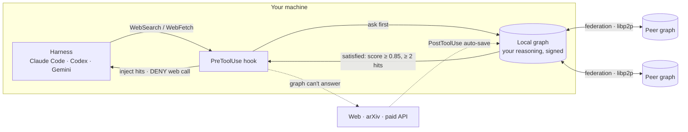

<div align="center">


# Folklore

**A torrent swarm for agent reasoning.**

Every peer shares the inference it already paid for, so your agent starts from what the swarm has worked out — not from zero. Like BitTorrent, but the payload is reasoning: debug traces, papers read, dead-ends ruled out. The more agents join, the less anyone re-derives. Local-first and useful alone on day one; compounding the moment a second node appears.

**[Site](https://usefolklore.com)** · **[Spec](docs/WHITEPAPER.md)** · **[RFC](docs/rfc/)** · **[Roadmap](docs/PROJECT-PLAN-FOLKLORE.md)** · **[npm](https://www.npmjs.com/package/@usefolklore/folklore)**


<br/>


<sub><b>Your knowledge, traveling the network — live.</b> Run <code>folklore live</code> and watch real peers pull traces from your tree in real time: <code>⬅ @sam-rs pulled tokio-rc-send-across-await from your tree · just now</code>. Every line is a real fetch off your running node — someone else's agent reusing what yours already worked out, instead of grinding it from zero. That's folklore: peers sharing hard-won reasoning, mouth to ear. <a href="examples/live-feed/">Reproduce it →</a></sub>

</div>

> Web-search fallback rate, in simulator: **17% → 1%** over 2,000 steps. Once anyone resolves a question, no one — you on Thursday, or any peer ever — pays for it again. [§ Proof](#proof)

---

## The problem

AI agents reason from zero, every single time. The same paper gets read again. The same dead-ends get walked again. The same conclusion gets re-derived — and re-billed — a thousand times across a thousand sessions.

You don't only pay Google. You pay OpenAI, Anthropic, and every paid endpoint, per token, to re-run inference over data someone already ground out yesterday. The work was done. The tokens were spent. Nobody kept the answer where the next agent could find it.

Memory tools exist — mem0, Letta, LangChain-style RAG — but they are single-user silos. They remember *your* chats. They don't gate the web, they don't carry provenance, and they certainly don't let another peer's hard-won debugging trace — the LLM inference they already paid for — become your starting point.

## What Folklore is

A graph of your agent's reasoning that lives on your machine, answers **before** the web, and federates peer-to-peer.

Two bets, in order:

1. **It works alone.** Day one, zero peers, it already pays off — your own research, debugging, and grounded conclusions are cached and reused. You never start from zero again.
2. **It compounds.** Every peer running it works for the next: each one's past LLM inference — the reasoning already paid for in tokens — becomes your starting point, and yours becomes theirs. No teammate or org boundary; the whole network shares resolved inference so nobody re-spends tokens on an answer someone already ground out. The commons gets deeper the more peers draw from it.

Folklore is the name for knowledge that gets passed on — story to story, peer to peer — instead of relearned from scratch.

---

## Day one: alone

No network required. Folklore sits between your agent and the web. Every research-shaped call — `WebSearch`, `WebFetch`, an arXiv pull, a fresh `Read` — is checked against your local graph first. If your graph already holds a confident answer, the call is satisfied from memory in milliseconds. If not, the call proceeds, and the result is auto-saved, signed by you, so the *next* time costs nothing.

This alone clears the bar that kills most memory projects: it is useful to one person, immediately.

```bash
folklore ask "how does mxbai-rerank compare to cross-encoder on long contexts?"
# → answered from your own graph if you've researched it; otherwise fetched + saved for next time
```

Retrieval quality is benchmarked, not asserted: **0.7522 NDCG@10** on full BEIR SciFact, CPU-only, 11 ms median — ahead of standard published BEIR SciFact retrievers (E5-base 0.737, E5-large 0.723, SPLADE 0.699, ColBERT 0.671, BM25 0.665); only a 3B GPU reranker (InRanker, 0.783) scores higher. No LLM grading an LLM.

## Day N: together

Add a peer and your graphs become queryable to each other over libp2p. Now the first hop isn't even your graph — it's the question *"what does the network already know about this?"* Only when nobody holds the answer does anyone pay the web.

Every record carries a provenance chain: signed by its curator's cryptographic identity and verified GitHub handle, timestamped, traceable to the sources it grounded on. Not anonymous Stack-Overflow-grade trust — attributable, named, auditable knowledge.

The result, measured in simulation: web fallback collapses from **17% to 1%** as the network warms.

---

## Where it fits

Folklore is not a competitor to MCP or A2A. It's the missing third layer.

| Layer | Standard | Question it answers |
|---|---|---|
| Tools | **MCP** | How does an agent *call* things? |
| Communication | **A2A** | How do agents *talk* to each other? |
| **Memory + research** | **Folklore** | What does the agent — and the network — *already know*, so it doesn't redo the work? |

And against the memory tools you might compare it to:

| | Folklore | mem0 / Letta | LangChain RAG | Web every time |
|---|:---:|:---:|:---:|:---:|
| Local-first, no server | ✅ | ⚠️ | ⚠️ | ✅ |
| Gates the web (answers before fetch) | ✅ | ❌ | ❌ | ❌ |
| Federated across peers | ✅ | ❌ | ❌ | — |
| Signed provenance per record | ✅ | ❌ | ❌ | ❌ |
| CPU-only, no API keys | ✅ | ⚠️ | ⚠️ | ❌ |
| Benchmarked retrieval (BEIR SciFact) | 0.7522 | not published | not published | — |

---

## How it works



Three moving parts:

- **A hook at the boundary.** A `PreToolUse` hook intercepts outbound research calls and asks the graph first. A `PostToolUse` hook saves whatever the web returned. Local tools (`Read`, `Grep`, `Glob`) are never touched — they're cheap and there's nothing to gain by blocking them.
- **A retrieval stack that earns the deny.** Hybrid lexical + vector recall (BM25 + ONNX embeddings + RRF), then cross-encoder rerank, then graph PPR rerank. A web call is only denied when the result clears a real satisfaction floor — see below.
- **A federation mesh.** Each peer holds only what it has asked for or contributed. No global graph, no central server. The union of every peer's graph is the commons.

Full technical detail: **[docs/ARCHITECTURE.md](docs/ARCHITECTURE.md)**.

### What "satisfactory" means

The web is the fallback, not the default — but "satisfied" is concrete, not a vibe. Three conditions, enforced at the hook:

| Knob | Default | Meaning |
|---|---|---|
| `satisfaction_score` | ≥ **0.85** | Top result must clear this after the full rerank pipeline. |
| `min_hits` | ≥ **2** | At least two graph hits. One brittle hit never overrides the web. |
| `decision` | = `use_memory` | The decision layer must affirmatively land on "answer from memory" — not "answer-but-verify", not "search web". |

When all three hold, the hook **denies** the web call and injects the graph hits as if the fetch had returned them. When any fails, the fetch proceeds and the result lands back in your graph, signed.

```bash
export FOLKLORE_DENY_WEBSEARCH=1      # opt in to deny-on-confidence (off by default)
export FOLKLORE_DENY_THRESHOLD=0.85   # satisfaction floor
export FOLKLORE_DENY_MIN_HITS=2       # minimum hits to allow a deny
export FOLKLORE_PREFETCH_PEERS=0      # local-only; skip federated fan-out
```

The deny pathway is opt-in by design: a false positive (graph says "I've got it" when it doesn't) costs more than a redundant fetch. You turn it on per project once you trust your graph's coverage.

**On calibration (honest note).** A single fixed `satisfaction_score ≥ 0.85` is a
blunt instrument: on a real, mixed personal graph the composite satisfaction
score is compressed and rarely reaches 0.85, so the fixed-threshold gate tends
to stay quiet. The calibrated alternative is the **energy gate** — it scores
admission as a free energy over the hits' embedding similarities
(`−E(q) = T·logsumexp(simᵢ/T)`), so several moderate hits *accumulate* evidence
instead of being clamped under a ceiling, plus a separation guard that rejects
the "two-close-answers blur together" case.

```bash
export FOLKLORE_ENERGY_GATE=1   # calibrated admission instead of the fixed 0.85 score gate
```

On a labeled real-query set (36 in-corpus / 22 out-of-corpus over the live graph,
`bench/bench-energy-gate.mjs`) the energy score separates in- from out-of-corpus
at **AUC 0.78** (the fixed composite manages ~0.52) and fires at **57% true-admit
/ 0% false-admit** at the fitted operating point. It is still opt-in and the
defaults are fitted on a small set — re-fit with the bench as your graph grows.
Run `folklore doctor` any time to see whether the hooks resolve and the
graph/vector stores are in sync (a degraded memory layer is reported loudly, not
silently).

---

## Proof

Three claims, each falsifiable, each on disk.

**Faster.** Federation-hit P50 ≈ 140 ms, against 1–2 s for a paid endpoint. Roughly an order of magnitude, every time after the first.

**More complete.** 0.7522 NDCG@10 on full BEIR SciFact, CPU-only, 11 ms median — vs published BEIR SciFact retrievers E5-base 0.737, E5-large 0.723, SPLADE 0.699, ColBERT 0.671, BM25 0.665; only a 3B GPU reranker (InRanker-3b, 0.783) scores higher. No LLM judging an LLM.

**Cheaper.** FolkloreBench-F simulates `web_fallback_rate(t)` over a realistic peer network with offline churn. First run, LoCoMo factual subset:

| Parameter | Value | | Metric | Value | Reading |
|---|---|---|---|---|---|
| Corpus | LoCoMo factual, 695 q | | `web_fallback_rate` (start) | 0.170 | 17% hit web at t=0 |
| Peers | 10, disjoint shards | | `web_fallback_rate` (end) | 0.010 | 1% hit web by t=2,000 |
| Sim steps | 2,000 | | Compounding slope | −4.74e-5 | negative — thesis holds |
| Offline churn | 20% | | Web fallback (final) | 4.5% | outbound only when unanswerable |

**These are simulator numbers, not pilot numbers.** v1 treats "does peer N hold doc D" as boolean and abstracts per-peer retrieval quality (measured separately by the LongMemEval / LoCoMo / BEIR benches in `tests/`). v2 plugs real retrieval in. Real-pilot validation is the 100-peer rollout queued next.

Bench source: [`tests/bench-folklore-federation.test.ts`](tests/bench-folklore-federation.test.ts).

**Gated correctly.** The deny-on-confidence gate is the mechanism — it has to deny the web
when the graph truly holds the answer, and *not* deny when it doesn't. On a labelled probe
set (59 corpus nodes; 44 in-corpus, 40 adversarial, 30 near-miss, 10 far-miss), the gate
denies **84.1%** of answerable queries (true-deny) at a **2.5%** false-deny rate — and
**0%** on far-miss probes, so a clearly out-of-corpus question is never wrongly gated.
Compounding view: across 64 peers the cooperative cache-hit rate is **90.2%** vs **18.4%**
for isolated local graphs — 4.9× more graph hits before any web trip.

**Sharing inference trees, measured on real corpora.** Beyond the simulator: when
peers share their resolved *(question → verified-doc)* trees, a new query
retrieves by matching the network's answered questions (query↔query, far stronger
than query↔doc for the same need) and inherits the verified answer. Measured on
real BEIR sets with real relevance judgments — recall@1 at a **matched ≤2%
false-accept** budget vs a proper single-node semantic cache (vCache-style),
always-paraphrase (no exact-query cache):

| corpus | single-node cache | federated tree-sharing | federation gain |
|---|---|---|---|
| SciFact | 81.5% | **98.2%** | **+20.5%** |
| NFCorpus | 77.3% | **97.6%** | **+26.2%** |
| FiQA | 66.0% | **94.5%** | **+43.3%** |

Same decision rule, same error budget — the gain is purely federation coverage
(the answer is more likely already in the pooled trees). And one subject-match
prefetches the whole subject subtree, so the next 4–8 questions land pre-answered.
Honest scope: this is **federated semantic-cache reuse**, not a cold-retrieval
SOTA claim (the cold path here is MiniLM); it needs a warm pool (a peer must have
answered it first). Bench: [`bench/bench-vcache-compare.mjs`](bench/bench-vcache-compare.mjs),
write-up: [`docs/research/inference-tree-sharing.md`](docs/research/inference-tree-sharing.md).

**Safer.** Anonymous retrieval is a poisoning surface — PoisonedRAG shows 5 injected
documents can drive a 97% attack success rate. Folklore signs every record, and the
provenance ranker keeps only signed gold while dropping unsigned poison. On a
gold-displaced poison matrix (BEIR SciFact, Haiku agent, Opus judge, 2,957 judged
cells across A1/A2/A3 attacks × rates {0,25,50,75}), baseline flip-ASR is **58.9%**;
with provenance ranking it falls to **2.4%** — a **24.8× reduction** — and total
attack-effect (flip + induced doubt) drops **83.8% → 9.8%** (8.58×). This is the same
lighter model with and without the protocol; it does not yet claim Haiku+protocol beats
Opus alone (the displaced head-to-head is queued). Eval harness is `claude -p`-driven,
no API key, no temperature-0.

### The math

For any topic `T` and time `t`, let `R(T, t)` be the number of peers holding resolved reasoning for `T`. Under Folklore's mechanism `R(T, t)` is **monotonically non-decreasing** — once anyone reasons through `T`, every later peer starts from that conclusion, not from zero. Compounding is a property of the architecture, not a marketing claim.

---

## Quickstart

```bash
npm install -g @usefolklore/folklore

folklore onboard        # one pass: daemon, all hooks, statusline, identity,
                        # + registers the MCP server in every harness it detects
```

That's the whole install. No Python, no submodule, no GitHub app required — the
core (MCP server, `ask`, the energy/deny gate, vectors, the MiniLM embedder) is
pure Node. GitHub identity and the Python ingest/viz sidecar are both optional and
can be added later (`folklore login`, `folklore doctor --fix`). To wire other
coding harnesses at any time:

```bash
folklore harness list       # show every MCP target + whether it's detected
folklore harness install    # register the folklore MCP server in each detected one
```

Save what teaches you:

```bash
folklore save --type synthesis --label "mxbai-rerank on long contexts" \
  --text "Cross-encoder wins under 512 tokens; mxbai-rerank degrades slower past 2k."
folklore save --label "cuda oom debug" --text "$(cat ./notes/cuda-oom-debug.md)" --private
folklore this           # or index the whole folder you're standing in
```

Connect to a peer and query the network:

```bash
folklore peer add /ip4/203.0.113.7/tcp/4001/p2p/12D3KooW...   # from their `folklore peer status`
folklore ask "how does mxbai-rerank compare to cross-encoder on long contexts?" --peers
```

**Federate. Compound. Continue.**

---

## Plugs into the harness you already use

You don't change how you work. Once Folklore is installed and your daemon is running, every research-shaped tool call is intercepted first. The harness asks Folklore before it asks the web.

Folklore is harness-agnostic and provider-agnostic: the MCP server exposes the
same `search` / `ask` / `get_node` / `get_neighbors` tools to any MCP-capable
harness, behind whatever LLM it drives — Anthropic, OpenAI, Gemini, Llama,
Mistral, DeepSeek, Ollama, Grok. The provider is the harness's; Folklore is the
retrieval layer underneath.

| Harness | How it wires in |
|---|---|
| **Claude Code** | `folklore claude install` — wires the full surface in one command: `PreToolUse` (graph prefetch + MCP-pre), `PostToolUse` (auto-save), `UserPromptSubmit` (prefetch), `SessionStart` (last-session context), the statusline panel, the gate env flags, and a CLAUDE.md section. |
| **Cursor · Cline · Windsurf · Zed · Gemini CLI · opencode · Roo Code · Claude Desktop** | `folklore harness install` — detects each and registers `folklore mcp start` in its native config (`mcpServers` / `context_servers` / `mcp`). The harness's tool-routing then prefers Folklore for query-shaped calls. |
| **Anything else that speaks MCP** | `folklore harness install --all`, or add `folklore mcp start` to its MCP config by hand. For harnesses with a `PreToolUse` hook, `folklore-smart-hook.cjs` is reusable too. |

---

## Ecosystem

| Package | What it is |
|---|---|
| `@usefolklore/folklore` | CLI + daemon + hooks (this repo) |
| `@usefolklore/core` | The retrieval + graph engine, embeddable |
| `folklore-rs` | Rust bench/federation harness |

---

## Roadmap

- **Now.** CPU-only retrieval at public-baseline parity; federation simulator validating the compounding thesis; the Claude Code integration.
- **Next.** FolkloreBench-F v2 (real per-peer retrieval, no boolean abstraction). 100-peer pilot in the local-AI / agent-tooling ecosystem; publish the real `web_fallback_rate` curve after 30 days of live traffic.
- **Then.** Provenance-attested retrieval against adversarial context — first result in (provenance ranking cuts poison flip-ASR 58.9% → 2.4%, see Proof); next, the Haiku+protocol vs Opus-alone head-to-head, and rarity-aware replication so niche knowledge survives its sole holder going offline.
- **After.** Read-only public peer endpoint ("browse the network", no install). The protocol spec, published once people are already using the tool.

---

## Open questions (RFC)

Design decisions still open for community input live in **[docs/rfc/](docs/rfc/)**. Start with [RFC-0001 — Folklore Core](docs/rfc/0001-folklore-core.md). Open an issue to weigh in.

---

## The name

Folklore is knowledge that survives by being passed on — story to story, person to person — never relearned from scratch. That's the protocol: each peer hands the next its hard-won reasoning, so the commons remembers what any one of us learned. The lore is the graph; the folk are the peers.

---

## Repository layout

```
folklore/
├── src/             # functional-DDD engine (domain / application / infrastructure / cli / daemon / mcp)
├── tests/           # the suite npm test runs
├── bench/           # standalone benchmark + sweep + qrel runners
├── spec/            # protocol spec surface — index into docs/rfc + V5-PROTOCOL
├── docs/            # architecture, product, research, brand, rfc, protocol, whitepaper
├── site/            # the marketing site (deploys independently via Cloudflare Pages)
├── examples/        # copy-paste runnable folklore CLI usage
├── folklore-rs/     # Rust retrieval crate
├── bin/             # CLI entrypoint (folklore.js)
├── config/          # config templates
├── vendor/          # git submodules (graphify)
└── .github/         # CI workflows + PR template
```

Full map and directory roles: [`docs/architecture/REPO-LAYOUT.md`](docs/architecture/REPO-LAYOUT.md).
The planned split into `usefolklore/folklore` (core+cli) / `folklore-spec` / `folklore-site` / `.github` is documented in [`docs/REPO-SPLIT.md`](docs/REPO-SPLIT.md).

## Contributing

Folklore is pre-launch. The federation simulator validates the thesis, retrieval benchmarks at parity with public single-user baselines, and the real pilot is the next milestone. We need:

- Contributors who run a peer in the local-AI / agent-tooling ecosystem during the pilot.
- Researchers willing to seed canonical artifacts (papers, debug threads, PRs) into their graphs.
- Engineers into libp2p, signed DIDs, or vector-search infrastructure.

Open an issue, fork the repo, or DM the maintainer. The door is open.

## License

MIT. Always an open protocol. Your contributions, signed by you. No central server. Ever.
