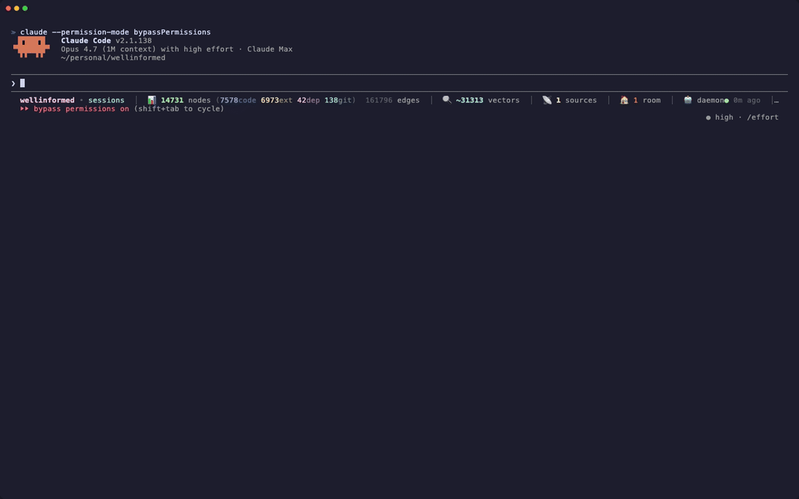

<p align="center">
  
</p>

<p align="center">
  <a href="https://github.com/SaharBarak/wellinformed/stargazers"></a>&nbsp;
  <a href="https://github.com/SaharBarak/wellinformed/network/members"></a>&nbsp;
  <a href="https://github.com/SaharBarak/wellinformed/watchers"></a>
</p>

<h1 align="center">The decentralized, globally accumulating knowledge network.</h1>

<p align="center">
  
</p>

<p align="center">
  <em>Real Claude Code session against a 5-daemon mesh. Claude runs <code>wellinformed ask --peers</code>, 4 peers respond, the top hit is attributed to a specific peer (not local), and Claude reports it back — all inside the session.</em>
</p>

> **Cooperative. Peer-to-peer. In the lineage of Napster, eMule, and BitTorrent — every peer's research compounds for the whole network. A sub-second federated retrieval replaces 90+ seconds of token-burning AI research. No one pays twice for the same answer.**

<p align="center">
  <b>75.22% NDCG@10 on BEIR SciFact</b> &nbsp;·&nbsp; CPU-only &nbsp;·&nbsp; 11&nbsp;ms p50 local &nbsp;·&nbsp;
  W3C did:key identity &nbsp;·&nbsp; libp2p federation &nbsp;·&nbsp; MIT
</p>

## Install

```bash
git clone https://github.com/SaharBarak/wellinformed.git
cd wellinformed && npm install && bash scripts/bootstrap.sh
```

## Wire into Claude Code

```bash
claude mcp add --scope user wellinformed -- wellinformed mcp
wellinformed claude install
```

The PreToolUse hook fires before every Glob, Grep, Read, WebSearch, and WebFetch — Claude sees graph hits in its prompt without asking. The PostToolUse hook saves WebSearch / WebFetch results back into the graph.

## System rooms

Two rooms exist on first boot. Auto-populated, P2P-shared, never created by hand.

| Room | Holds | Stale-after |
|---|---|---|
| `toolshed` | codebase, deps, git history, MCP tools, skills | 30 days |
| `research` | arxiv, HN, RSS, web fetches, web searches | 7 days |

Every hit carries `age_days` so the agent decides trust vs refetch on its own.

## Reproduce the demo

```bash
bash demo/setup-p2p.sh                                # 5-daemon mesh on 127.0.0.1
export WELLINFORMED_HOME=~/.wellinformed.demo
wellinformed ask --peers "open hardware Raman 532nm hydrogen" --k 5
bash demo/teardown-p2p.sh                             # done
```

Or reproduce the recording itself: `bash demo/scene-federated.sh` regenerates `demo/scene-federated.gif` from scratch.

## Deep dives

The technical detail lives in `docs/`:

- [`docs/BENCHMARKS.md`](docs/BENCHMARKS.md) — full BEIR v1, Phase 25 SOTA, 13 documented null attacks, reproduction scripts
- [`docs/VISION.md`](docs/VISION.md) — the agent-memory protocol problem
- [`docs/MANIFESTO.md`](docs/MANIFESTO.md) — why this exists, the cooperative knowledge layer
- [`docs/ROADMAP.md`](docs/ROADMAP.md) — north star, priorities, definition of done
- [`docs/P2P-VISION.md`](docs/P2P-VISION.md) — federation, identity, room sharing

Architecture surface: 23 MCP tools (`search`, `ask`, `get_node`, `get_neighbors`, `find_tunnels`, `federated_search`, `oracle_ask`, `code_graph_query`, …); W3C `did:key` over Ed25519 with BIP39 recovery; libp2p Noise-encrypted transport with circuit-relay-v2 + dcutr NAT traversal; Y.js CRDT room sync.

## Star history

<a href="https://www.star-history.com/#SaharBarak/wellinformed&Date">
  <picture>
    <source media="(prefers-color-scheme: dark)" srcset="https://api.star-history.com/svg?repos=SaharBarak/wellinformed&type=Date&theme=dark" />
    
  </picture>
</a>

## Contributing

New source adapters, platform guides, worked examples — one file each under `src/infrastructure/sources/` or open an issue. Response within 48 hours.

## License

MIT.
