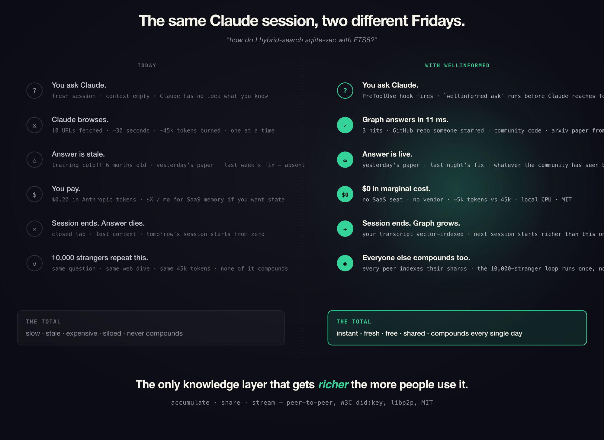

<p align="center">
  
</p>

<p align="center">
  <a href="https://github.com/SaharBarak/wellinformed/stargazers"></a>&nbsp;
  <a href="https://github.com/SaharBarak/wellinformed/network/members"></a>&nbsp;
  <a href="https://github.com/SaharBarak/wellinformed/watchers"></a>
</p>

<h1 align="center">The globally accumulating knowledge network.<br/>For AI agents &mdash; and humans.</h1>

<p align="center">
  <em>What a Claude Code session looks like with wellinformed wired in — captured against this repo's own graph.</em>
</p>

```text
You ▸ How does wellinformed sync rooms across peers, and what's the
       security boundary?

       (wellinformed retrieves 3 matching nodes from your graph in 11 ms.
        No web search. No tokens spent on retrieval.)

       → .planning/phases/phase-16/16-CONTEXT.md
         "Mark rooms as public and sync their nodes via Y.js CRDTs.
          Metadata-only replication, enforced by the SEC-03 boundary
          Phase 15 established."

       → docs/P2P-VISION.md
         "When researcher A indexes a paper on 'efficient attention',
          researcher B (tracking GPU optimization) gets a tunnel
          notification — their work connects to A's paper."

       → .planning/v2.1-CANDIDATES.md
         "Phase 21 — DHT bootstrap + record publication: enable kad-dht,
          configure bootstrap nodes, publish own peer record on join."

Claude ▸ Rooms sync peer-to-peer over Y.js CRDTs — metadata-only,
         enforced by the SEC-03 boundary from Phase 15. Peers exchange
         state vectors and apply only the missing updates; offline
         peers reconcile on reconnect. The DHT layer in Phase 21–22
         extends this to the public internet without a central registry.
```

<p align="center">
  <em>Claude answered from your graph in one round-trip, citing your phases and your security boundary by name. Without wellinformed: ~30 s of WebFetch calls returning generic libp2p docs that don't know about your project at all.</em>
</p>

> **Cooperative. Peer-to-peer. In the lineage of Napster, eMule, and BitTorrent — every peer's research compounds for the whole network, and a sub-second retrieval replaces 90+ seconds of token-burning AI research. No one pays twice for the same answer.**

<p align="center">
  <b>75.22% NDCG@10 on BEIR SciFact</b> &nbsp;·&nbsp; CPU-only &nbsp;·&nbsp; 11 ms p50 &nbsp;·&nbsp;
  <b>13 documented null attacks</b> &nbsp;·&nbsp; W3C did:key identity &nbsp;·&nbsp; libp2p federation &nbsp;·&nbsp; MIT
</p>

## Reproduce it

The session above is real. The three retrieved nodes are real files in this repo. To get the same on yours:

```bash
wellinformed index                              # parse cwd repo into the graph
wellinformed ask "<your question>" --k 3        # see what the LLM would see
```

Once you've run `wellinformed claude install`, retrieval fires automatically as a PreToolUse hook before every Glob, Grep, Read, WebSearch, and WebFetch — Claude sees the hits in its prompt without having to ask for them.

## Why wellinformed exists

The frontier-model economy isn't sustainable, and everyone paying attention knows it. Compute costs climb. Training runs burn hundreds of millions. Investors want returns. Governments want levers — a US administration can decide tomorrow that an AI lab is strategic infrastructure and reshape its trajectory with a phone call. When that happens your workflow's weather changes overnight: prices hike, models deprecate, weights get silently swapped, terms tighten, behaviors drift. The customer is never consulted.

The open-source community — tens of thousands of engineers, researchers, and operators — already writes the code, benchmarks the models, builds the tools, and documents the failure modes faster than any single lab can absorb them. Closed labs race; the open-source ecosystem evolves.

**wellinformed is how that ecosystem shares its knowledge.**

Ten thousand developers asking the same question ten thousand times a day. Ten thousand isolated 30-minute web searches. Same papers, same GitHub repos, same Stack Overflow threads, all re-derived alone, all billable. None of it accumulates. Each of us holds a shard of what's current — the regression we hit at 3 am and fixed, the library migration we finished Tuesday, the arXiv paper that dropped two hours ago, the CI config that broke after Node 25 shipped. None of that is in any frozen-weight model because it happened *after* training ended. Alone, those shards die when the session closes. Federated, they become the only live index of the field. Knowledge compounds across the community faster than any quarterly pre-training dump can keep up. Your Claude session starts from what ten thousand peers have already measured — not what a foundation model memorized six months ago.

Decentralized means the knowledge can't be revoked. When a lab gets acquired, sanctioned, or reorganized, your graph doesn't care. Your identity is a W3C `did:key` you own — the math on your keyring, not a row in someone else's user table. Shared memory carries signed envelopes verifiable offline in under 2 ms. Nobody emails support, because nobody operates "support."

The result: fewer tokens burned on repeated research, richer sessions every time a peer in your network learns something new, automatic propagation of best practices and current tools, context that stays fresh between pre-training cuts. The open-source movement open-sourced the code. **wellinformed open-sources the knowledge graph itself.** That's the next step.

## The three pillars

**1. Each peer carries a shard of what's current — together, the live index.** Every wellinformed instance is a libp2p peer. Rooms sync across peers via Y.js CRDT. A federated `ask --peers` fans a query across the network in parallel, 2-second per-peer timeout, results merged by cosine distance with per-peer attribution. The stranger who read that paper last Thursday, the peer who benchmarked that library two weeks ago, the dev who debugged that exact bug last night — their embeddings flow into your session. Nobody knows the whole graph; together the community does — the live state of the field, something no frozen-weight model can touch.

**2. Your identity is math you own.** W3C `did:key` over Ed25519 on first boot, BIP39 24-word recovery, hardware-authorized device keys. Every shared memory carries a signed envelope verifiable offline in under 2 ms. No registry, no resolver, no customer record to revoke. When the VC-funded memory category changes pricing, yours stays.

**3. Retrieval that's measured, not claimed.** 75.22% NDCG@10 on full BEIR SciFact (5,183 × 300) — 1.2 pts above published bge-base dense, 1.5 below GPU-only monoT5-3B. 13 separate algorithmic attacks nulled and documented, including a full gpt-oss:20b κ=0.7053 LLM-as-judge calibration audit that puts the instrument-corrected ceiling at ~81%. Every null is reproducible; the hard part of retrieval is knowing what you can't claim.

## The only knowledge layer that gets richer the more people use it

<p align="center">
  
</p>

**Same question. Same developer. Two different Fridays.**

Without wellinformed, your Claude session starts empty every time. Claude browses ten URLs, burns forty-five thousand tokens, takes thirty seconds, returns an answer half a year stale, and dies with the tab. Ten thousand other people run the exact same loop the same day. None of it compounds.

With wellinformed, the `PreToolUse` hook fires before Claude reaches for the web. Your graph — already holding every arXiv paper you've pulled, every repo you've starred, every past session you've had, plus every shard shared by every other peer running wellinformed — answers in **11 ms**. Three hits across three rooms: a GitHub repo someone starred yesterday, a piece of community code you hadn't seen, an arXiv paper from two hours ago. Claude replies instantly from the community's latest state. When the session ends, your transcript is vector-indexed back into the graph so tomorrow's session starts richer than today's. And every peer on the network is doing the same — the ten-thousand-stranger loop runs **once**, not ten thousand times.

That's the compound. Every new contributor makes every existing session better. The graph is the only memory layer in the AI stack that goes the *other* direction: up and to the right, forever, at zero marginal cost.

**Sources for the canonical stack** this diagram contrasts against: Anthropic's [Claude Code best-practices doc](https://code.claude.com/docs/en/best-practices) and the 2026 community comparisons of mem0 / Zep / Letta / Engram / MemPalace / mcp-memory-service.

## Install

```bash
git clone https://github.com/SaharBarak/wellinformed.git && cd wellinformed
npm install && bash scripts/bootstrap.sh
```

## Try it

```bash
wellinformed init                      # create a room, pick your sources
wellinformed trigger --room homelab    # fetch from ArXiv, HN, RSS, blogs, any URL
wellinformed index                     # index your codebase + deps + git
```

## Wire it into Claude Code (once, globally)

Register wellinformed as a **user-scoped MCP server** so every project gets it automatically — no `.mcp.json` per repo, no restart for each new project:

```bash
claude mcp add --scope user wellinformed -- wellinformed mcp
wellinformed claude install            # PreToolUse hook — Claude checks the graph first
```

After this, opening any project in Claude Code has `search`, `ask`, `get_node`, `get_neighbors`, `find_tunnels` available immediately. Claude checks your knowledge graph before every file search — no explicit ask needed.

> If you only want it in the current project, skip `--scope user` and a `.mcp.json` will be written locally instead.

## What it indexes

| Source | What you get |
|---|---|
| **ArXiv** | Papers matching your keywords, chunked and embedded |
| **Hacker News** | Stories via Algolia search |
| **RSS / Atom** | Any feed — blogs, newsletters, release notes, podcasts |
| **Any URL** | Article-extracted via Mozilla Readability |
| **Your .ts/.js files** | Exports, imports, doc comments per file |
| **package.json** | Every dependency with version, description, homepage |
| **Git history** | Recent commits with changed file lists |
| **Git submodules** | Remote URL, branch, HEAD SHA |
| **Discovery loop** | Recursively finds MORE sources from indexed content keywords |
| **X / Twitter** | Posts and threads via OAuth 2.0 (publish + ingest) |

Source discovery suggests new feeds automatically from your room's keywords:

```bash
wellinformed discover --room homelab --auto
# → adds selfh.st RSS, ArXiv query, HN search — based on your keywords
```

## How Claude uses it

After `wellinformed claude install`, a PreToolUse hook fires before every Glob/Grep/Read. Claude sees:

> *"wellinformed: Knowledge graph exists (425 nodes). Consider using search, ask, get_node before searching raw files."*

Claude then calls the MCP tools instead of grepping. 21 tools available:

`search` · `ask` · `get_node` · `get_neighbors` · `find_tunnels` · `trigger_room` · `discover_loop` · `graph_stats` · `room_create` · `room_list` · `sources_list` · `federated_search` · `code_graph_query` · `recent_sessions` · `deep_search` · `oracle_ask` · `oracle_answer` · `list_open_questions` · `oracle_answers` · `oracle_answerable`

The v2.1 hook layer goes further: before every Grep/Glob/Read/WebSearch/WebFetch, a PreToolUse hook runs `wellinformed ask --json` on the extracted query and injects the top-3 hits into Claude's context. On a miss, the query is logged for later ingest. After every WebSearch/WebFetch, a PostToolUse hook auto-saves the result as a `source` node in the always-on `research` system room so the next session finds it via the graph instead of the network.

Works with **Claude Code** (auto-discovered), **Codex**, **OpenClaw**, and any MCP host.

## Rooms & tunnels

Rooms partition the graph. `homelab` doesn't see `fundraise`. Each room has its own sources and search scope. There are three layers:

- **Three always-on system rooms** — `toolshed` / `research` / `oracle` advertised out of the box by every peer, with virtual membership derived from node `source_uri` scheme (see below).
- **One room per repo** — when you `wellinformed index` a codebase (or Claude Code opens one), wellinformed provisions a dedicated room for it. The repo name becomes the room id — `my-app`, `auto-tlv`, `wellinformed-dev` — and its embeddings, commits, and docs stay scoped to that room. Switching projects switches rooms automatically; queries stay relevant to the repo you're in without cross-contamination.
- **Custom rooms** — anything you create yourself (`homelab`, `fundraise`, `reading-list`, etc.). Full control over sources, sharing, and retention.

**Tunnels** are the exception — when nodes in different rooms are semantically close, wellinformed flags them. A paper about embedding quantization in `ml-papers` connects to a memory issue in `homelab`. That connection is what rooms exist to produce.

## P2P distributed knowledge graph (v2.0)

Every wellinformed instance is a libp2p peer with a cryptographic identity. Rooms can be shared across peers via Y.js CRDT. Search runs federated across the network. mDNS auto-discovers peers on your LAN; NAT traversal via circuit-relay-v2 + dcutr + UPnP handles the public internet. All traffic is encrypted by libp2p Noise; peers authenticate via ed25519 during the handshake.

```bash
# peer identity + manual peer management (Phase 15)
wellinformed peer status                          # show your PeerId + public key
wellinformed peer add /ip4/1.2.3.4/tcp/9001      # connect to a remote peer
wellinformed peer list                            # known peers (--json for agents)

# share rooms via Y.js CRDT (Phase 16)
wellinformed share audit --room homelab           # see exactly what would be shared
wellinformed share room homelab                   # mark room as shared (audit-gated)
wellinformed unshare homelab                      # stop sharing (keeps local .ydoc)

# federated search (Phase 17)
wellinformed ask "proxmox GPU passthrough" --peers  # query across connected peers
```

**Security model** (Phase 15 + 17):
- `share audit` scans every node against **14 secret patterns** — API keys (OpenAI, GitHub, Stripe, AWS, Slack, Google), JWT-anchored bearer tokens, private key blocks, env vars — and hard-blocks the room if anything matches
- Shared nodes carry **only** metadata: `id`, `label`, `room`, `embedding_id`, `source_uri`, `fetched_at`. No raw text, no file paths, no file contents, and **no raw embedding vectors** (to prevent embedding-inversion attacks). Cross-peer semantic search re-embeds locally on the receiving side
- Inbound updates are symmetrically scanned — a malicious peer cannot push secrets into your graph
- Rate limiting (token bucket per peer) prevents query floods

**Y.js CRDT sync** (Phase 16): `share room X` creates a Y.Doc, pushes existing nodes, and the daemon syncs incremental updates to connected peers via a custom libp2p protocol. Offline peers catch up automatically via y-protocols sync step 1+2. Concurrent edits converge with zero conflict logic on your part.

**Federated search + discovery** (Phase 17): `ask --peers` embeds your query locally, fans out to connected peers with a 2s per-peer timeout, each runs sqlite-vec against its own shared-room vectors, results merge by cosine distance with `_source_peer` annotation. mDNS auto-discovers peers on your LAN. DHT wiring lands off-by-default for internet-wide discovery.

**Production networking** (Phase 18): libp2p circuit-relay-v2 + dcutr (direct connection upgrade via hole punching) + UPnP port forwarding handle NAT traversal. Application-layer bandwidth limiter caps per-peer-per-room updates. Passive connection health monitoring flags degraded peers without active probes. **10 simultaneous peers connect in-process in ~2.5s** (integration tested).

## System rooms + oracle bulletin board (v2.1)

Every wellinformed peer advertises **three always-on system rooms** out of the box. No opt-in, no manual sharing — every peer can touch them immediately:

| System room | What it contains | Stale-after |
|---|---|---|
| `toolshed` | codebase, skills, MCP tools, deps, git history — "what this peer can do" | 30 days |
| `research` | arxiv, hn, rss, web searches, web fetches, telegram — "what this peer has read" | 7 days |
| `oracle` | Q&A bulletin board — questions + answers propagate via touch + CRDT | 14 days |

Membership is **virtual** — derived from each node's `source_uri` scheme, not from its physical `room` field. A git commit tagged `room: wellinformed-dev` still shows up in `toolshed` for peers. User-chosen rooms stay intact; system rooms are an additional query-time lens.

**Data aging:** every graph hit now surfaces `fetched_at` + numeric `age_days`. The prefetch hook renders compact age tags inline: `label [research, 3d] d=0.82`. If a hit is older than the room's `staleAfterDays` window, Claude prefers a fresh pull over the cache. The trust boundary (remote-node-validator) **requires** `fetched_at` on every inbound node — a node with no timestamp is indistinguishable from a node forged ten years ago and gets rejected.

**Opt-out** for sensitive rooms: mark them `shareable: false` in `shared-rooms.json` (or via the interactive picker below) and nodes in them are excluded from system-room virtual membership.

```bash
wellinformed share ui                             # interactive toggle list
                                                  # (zero-dep ANSI; system rooms are never shown)
```

### Oracle — peer-to-peer Q&A at zero protocol cost

The oracle bulletin board (Layer A of peer discovery) reuses the existing `touch` + CRDT surface. No new wire protocol, no new rate limiter.

```bash
wellinformed oracle ask "how do I wire prefetch hooks without adding a dep?"
# → node oracle-question:<uuid> lands in your graph, room=oracle
# → any peer touches `oracle` on next cycle, receives it

wellinformed oracle answerable                    # what can your graph plausibly answer?
wellinformed oracle answer <qid> "use raw ANSI + setRawMode" --confidence 0.85
wellinformed oracle show <qid>                    # confidence-ranked answers
```

**Layer B — live oracle queries via libp2p pubsub:**

```bash
wellinformed oracle ask "..." --live              # publishes over pubsub for real-time fan-out
wellinformed oracle answer <qid> "..." --live     # live response path
wellinformed daemon start                         # daemon subscribes at boot and upserts
                                                  # inbound questions/answers in real-time
```

Layer A (touch, seconds to minutes) and Layer B (pubsub, sub-second) use the same node shape and validator, so they compose cleanly. Layer A is the durable backing store; Layer B is the fast path when both sides are online.

`@libp2p/floodsub` ships Layer B today; gossipsub's latest still targets libp2p/interface v2 while wellinformed runs v3 — the service API is identical so a future swap is a one-line change.

### Save distilled insights

Beyond raw ingest, `wellinformed save` files typed notes (synthesis / concept / decision / source) that outlive chat transcripts. Ported from [claude-obsidian](https://github.com/AgriciDaniel/claude-obsidian) — reused for the Q&A distillation flow.

```bash
wellinformed save --room project --type synthesis --label "Touch primitive" \
  --text "Asymmetric P2P pull replacing symmetric Y.js intersection rule"
echo "body..." | wellinformed save --room project --type concept --label "RNG tunnels"
```

Saved nodes are both vector-embedded and BM25-indexed so they surface from `ask` / `search` immediately.

## Decentralized identity — your keypair, not someone's customer record (v2.1, DID wave)

Every wellinformed install provisions a W3C `did:key` on first boot. Ed25519 keypair, 32-byte pubkey, base58btc-encoded with the `0xed01` multicodec prefix per the [did:key spec](https://w3c-ccg.github.io/did-method-key/). The user DID is long-lived and survives device changes; a device key is authorized by the user DID via a signed tuple `(device_id, device_pub, authorized_at)` so individual devices can be rotated without losing identity.

```bash
wellinformed identity show           # prints your user DID + authorized devices
wellinformed identity rotate         # new device key, same user DID, old device revoked
wellinformed identity export         # BIP39 mnemonic recovery phrase
wellinformed identity import         # restore from recovery phrase on a new machine
```

**Signed envelopes at the wire** — any outbound node (memory entry, oracle answer, room share) can be wrapped with a device signature + the device-authorization chain. Receivers verify the whole chain **offline, in under 2 ms, three Ed25519 checks**. No DID resolver, no registry lookup, no network call. Domain-separation tags (`wellinformed-auth:v1:` vs `wellinformed-sig:v1:`) prevent replay of authorization signatures as payload signatures.
**Why this matters:** the VC-funded AI memory category holds your identity in their user table. When they change pricing, when they get acquired, when they revoke your account — they take your identity with them. wellinformed's identity is math you already own; no intermediary to revoke it.

## Structured codebase indexing (v2.0, Phase 19)

Separate from the research graph, wellinformed parses codebases into a rich structured code graph via tree-sitter. Codebases are first-class aggregates attachable to rooms via a join table. Nothing mixes the research nodes and the code nodes — two distinct graphs, two distinct query surfaces.

```bash
wellinformed codebase index ~/work/my-app         # parse with tree-sitter (TS+JS+Python)
wellinformed codebase attach <id> --room homelab  # attach to a research room (M:N)
wellinformed codebase search "loadConfig"          # lexical search across attached codebases
wellinformed codebase list --json                  # machine-readable view with node counts
```

Schema captures: **file**, **module**, **class**, **interface**, **function**, **method**, **import**, **export**, **type_alias** (9 node kinds) with **contains**, **imports**, **extends**, **implements**, **calls** edges (5 kinds). Call graph resolution is best-effort with confidence levels (`exact` / `heuristic` / `unresolved`). Trivial pattern detection tags `Factory` / `Singleton` / `Observer` / `Builder` / `Adapter` classes. Stored in a separate SQLite file at `~/.wellinformed/code-graph.db` — wiping and re-indexing is safe without losing your research embeddings.

Claude queries the code graph via the new `code_graph_query` MCP tool, separate from `search`/`ask` which remain research-only.

## Discovery loop

```bash
wellinformed discover-loop --room homelab --max-iterations 3
# iteration 1: found 4 sources from room keywords
# iteration 2: found 2 more from extracted keywords ("VFIO", "iommu")
# iteration 3: found 0 new — converged
# total: 6 new sources, 42 new nodes
```

The discovery loop agent expands your sources recursively: discover feeds from keywords, index them, extract new keywords from the content, discover more. Converges when nothing new is found.

## Publish to X/Twitter

```bash
export X_CLIENT_ID="your_client_id"    # from developer.x.com
wellinformed publish auth              # OAuth 2.0 — opens browser
wellinformed publish preview           # see what would be posted
wellinformed publish launch            # post the launch thread
wellinformed publish tweet "text"      # post a single tweet
```

## Background daemon

```bash
wellinformed daemon start              # runs trigger on a schedule
wellinformed daemon status             # check if running
wellinformed report --room homelab     # see what's new
```

## Deep dives

The technical detail lives in `docs/`:

- [`docs/BENCHMARKS.md`](docs/BENCHMARKS.md) — full BEIR v1 results, Phase 25 SOTA, 13 documented null attacks, reproduction scripts
- [`docs/VISION.md`](docs/VISION.md) — the agent-memory protocol problem and where wellinformed sits in it
- [`docs/MANIFESTO.md`](docs/MANIFESTO.md) — why this exists, the three pillars, the cooperative knowledge layer
- [`docs/ROADMAP.md`](docs/ROADMAP.md) — north star, priorities, definition of done, explicit out-of-scope

Headline numbers: 75.22% NDCG@10 on BEIR SciFact, 11 ms p50, CPU-only.

## Star history

<a href="https://www.star-history.com/#SaharBarak/wellinformed&Date">
  <picture>
    <source media="(prefers-color-scheme: dark)" srcset="https://api.star-history.com/svg?repos=SaharBarak/wellinformed&type=Date&theme=dark" />
    <source media="(prefers-color-scheme: light)" srcset="https://api.star-history.com/svg?repos=SaharBarak/wellinformed&type=Date" />
    
  </picture>
</a>

## Contributing

1. **New source adapters** — GitHub trending, Reddit, Telegram. One file each under `src/infrastructure/sources/`.
2. **Platform guides** — Tested setup for Cursor, Copilot, Gemini CLI.
3. **Worked examples** — Run it on a real corpus. Share what the graph surfaced.

We respond within 48 hours.

## License

MIT
