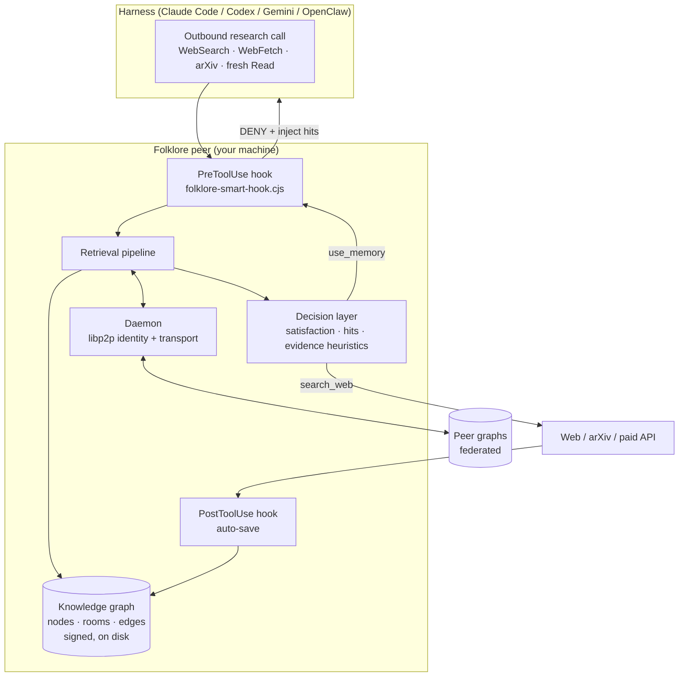
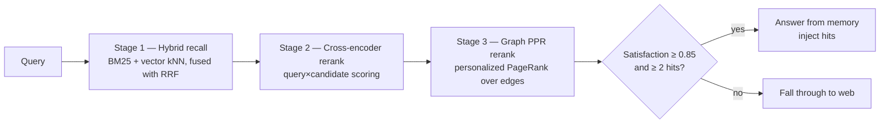
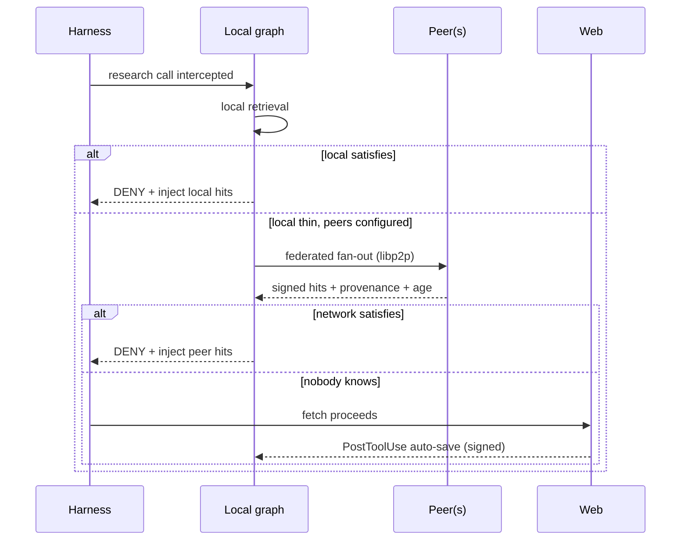

# Folklore — Architecture

How Folklore turns "ask the web" into "ask what's already known", locally first and across peers second. This document is the technical companion to the [README](../README.md); it describes the moving parts, the retrieval pipeline, the deny semantics, and the federation model.

## System overview

Folklore runs as a local daemon plus a pair of harness hooks. The daemon owns the graph, the retrieval stack, and the libp2p identity. The hooks are the only thing the harness sees.

## Data model

The graph is the unit of everything. Each **node** is one atom of knowledge — a fetched source, a debug trace, a synthesized claim — with:

- `content` and an embedding (ONNX `all-MiniLM-L6-v2`, 384-dim, CPU)
- `source_uri` — where it came from; the scheme decides its room
- `fetched_at` / `age_days` — freshness, surfaced on every hit
- a **signature**: the curator's cryptographic identity + verified GitHub handle
- typed **edges** to related nodes (supports, contradicts, supersedes, elaborates, …)

### Rooms

Rooms are virtual collections derived from each node's `source_uri` scheme, not a stored field. Two system rooms ship always-on and federated:

| Room | Holds | Stale-after |
|---|---|---|
| `toolshed` | codebase, skills, MCP tools, deps, git history — "what this peer can do" | 30 days |
| `research` | arXiv, HN, RSS, web searches, web fetches — "what this peer recently read" | 7 days |

A URL-sourced save lands in `research`; a codebase save lands in `toolshed`. Every other room is user-negotiable and opt-in.

### Freshness rule

Every hit carries `age_days` and `fetched_at`. Inside a room's stale-after window, the cache is trusted; past it, a fresh pull is preferred and the auto-save replaces the stale node. A hit with no `fetched_at` is treated as stale of unknown age.

## Retrieval pipeline

The deny is only as trustworthy as the retrieval behind it. Three stages, CPU-only:

1. **Hybrid recall** — lexical (BM25) and dense (vector kNN) candidates fused with Reciprocal Rank Fusion. Catches both exact-term and semantic matches.
2. **Cross-encoder rerank** — a small reranker scores each candidate against the full query; this is where precision comes from (benchmarked at 0.7522 NDCG@10 on BEIR SciFact).
3. **Graph PPR rerank** — personalized PageRank over the typed edges promotes nodes that are well-connected to other relevant nodes, surfacing syntheses and their supporting sources together.

Storage is `sql.js` (WASM SQLite, no native compile) with DiskANN-style SSD-friendly vector search.

## Deny semantics

A web call is denied only when the decision layer affirmatively returns `use_memory` **and** `satisfaction_score ≥ 0.85` **and** `min_hits ≥ 2`. Anything short of all three — a single strong hit, a "verify-anyway" decision, a shallow-evidence flag — lets the fetch proceed. The fetched result is then signed and saved, so the next equivalent query is answerable from memory.

This is opt-in (`FOLKLORE_DENY_WEBSEARCH=1`) because a false deny costs more than a redundant fetch. Local tools (`Read`, `Grep`, `Glob`) are never gated.

## Federation

Each peer advertises its rooms and answers federated queries against its own graph. Membership is virtual — derived from `source_uri` schemes. There is no central server: peers talk directly over libp2p, and the union of all peer graphs is the commons. Disk cost per peer scales with that peer's own curiosity, not the network's total volume.

Provenance is end-to-end: every federated hit arrives signed by its curator's identity and verified GitHub handle, traceable to its sources and timestamp. This is what lets a consumer reason about — and potentially refuse — adversarial or stale retrieval, a defense anonymous RAG can't offer.

## Tuning knobs

| Env | Default | Effect |
|---|---|---|
| `FOLKLORE_DENY_WEBSEARCH` | off | enable deny-on-confidence |
| `FOLKLORE_DENY_THRESHOLD` | 0.85 | satisfaction floor for a deny |
| `FOLKLORE_DENY_MIN_HITS` | 2 | minimum graph hits before denying |
| `FOLKLORE_PREFETCH_PEERS` | on | federated fan-out; `0` forces local-only |

See the [README](../README.md) for the product framing and [RFC-0001](rfc/0001-folklore-core.md) for the on-the-wire definitions.
