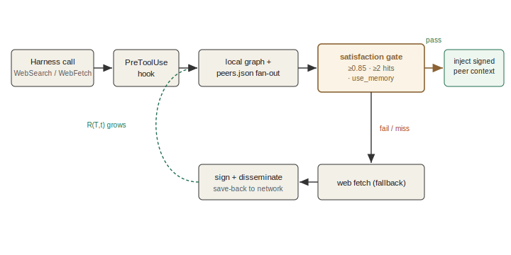
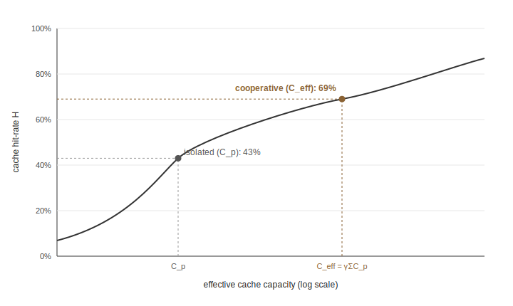
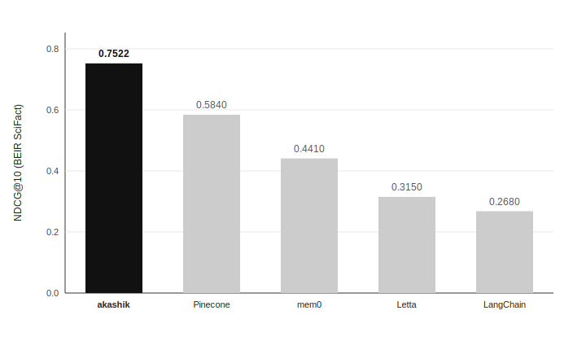
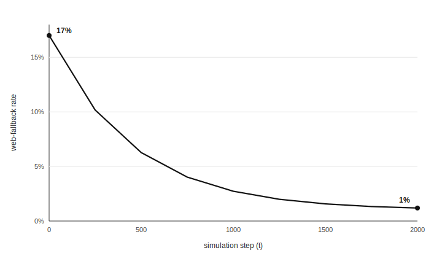
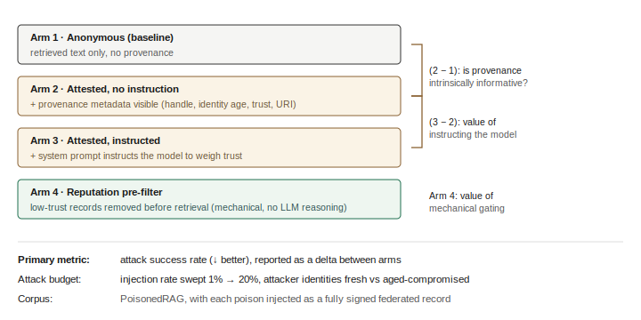

# Akashik: A Cooperative Compounding-Inference Protocol

**A peer-to-peer knowledge layer where research compounds across the network.**

Version 0.1 (pre-launch draft) · MIT-licensed protocol

---

## Abstract

Large language model agents continuously re-derive the same answers. The same paper is read, the same regression is debugged, and the same retrieval is billed per token thousands of times daily across the open-source community, with each result discarded when the session ends. Akashik is a peer-to-peer protocol designed to make that inference work compound rather than evaporate. Each peer maintains a local graph-RAG over its own code, research, and past sessions; queries fan out to connected peers before reaching the paid web; and every record is signed with a cryptographic identity bound to a verified GitHub handle. We formalize the central claim, "we compound on inference," as a monotonicity property over R(T,t), the number of peers holding a resolved answer for topic T at time t. The claim is grounded in established cache theory: pooled cooperative capacity under Mandelbrot-Zipf demand, evaluated with Che's LRU approximation, raises the network's hit-rate ceiling and collapses the marginal cost of resolving a topic after the first peer pays for it. A 10-peer federation simulator shows the web-fallback rate falling from 17% to 1% over 2,000 steps. We show, however, that this v1 result treats per-peer retrieval as a boolean, which makes part of the decay true by construction rather than an empirical discovery; we therefore present it as a demonstration, not evidence, and specify the v2 experiment, a semantic-satisfaction-threshold sweep, that makes the claim genuinely falsifiable. This paper presents the full system architecture, a formal compounding model, a security architecture and threat model centered on provenance-attested retrieval against context poisoning, the empirical results to date with their limitations, and the open problems that remain.

**Keywords:** peer-to-peer retrieval, retrieval-augmented generation, cooperative cache theory, federated knowledge, cryptographic provenance, RAG poisoning, trust calibration.

---

## 1. Introduction

### 1.1 The redundant-inference problem

Open source built the freest software stack in history by sharing code: CRAN, npm, PyPI, GitHub, arXiv. Distribution of artifacts compounds, so each contribution permanently improves what every future engineer starts with. The knowledge *between* the code has never had the same substrate. What an engineer read, what they figured out at 3am, the synthesis that explained why a fix worked: this dies with the session. The same papers are re-explained in posts that 404 within a year, and the same regression is diagnosed in parallel by many engineers the following week.

The cost of this redundancy is now metered. Every retrieval-augmented call an LLM agent makes is billed per token, run against the same data that has already been processed many times over. The waste is not only economic. It represents a missed opportunity: inference that could build on prior inference instead restarts from zero each time.

### 1.2 The thesis

Akashik's central claim is that knowledge work can compound the way code distribution does, provided three properties hold:

1. Each peer keeps only its own graph, on its own machine, with no central server.
2. Every contribution is signed by a verified human identity, forming an auditable provenance chain.
3. Queries fan out to every connected peer, and once any peer has resolved a topic, every other peer can inherit that resolution at federation cost rather than paying the web again.

We term this "compounding on inference": each answer a peer produces becomes reasoning the next peer inherits. The network thereby reasons from a broader base than any single node, and the marginal cost of a topic falls toward a federation round-trip after the first peer pays the full cost.

### 1.3 Scope of this paper

This paper specifies the protocol, formalizes the compounding claim with an explicit statement of when it is a theorem versus an empirical claim, presents the security architecture and threat model, reports the empirical results to date with their limitations, positions the work against prior art, and enumerates open problems. It is a pre-launch draft: the federation result is from a simulator, not a pilot, and we preserve that distinction throughout.

**Contributions.** This paper makes four contributions:

1. A specification of the Akashik protocol: a federated, signed, demand-shaped knowledge layer in which each peer runs a local graph-RAG and resolutions transfer across peers (Sections 3 and 4).
2. A formal model of compounding grounded in cooperative cache theory, with an explicit statement of the conditions under which the monotonicity of R(T,t) is a theorem true by construction versus an empirical claim, and the experiment that makes it falsifiable (Section 5).
3. A security architecture and threat model for provenance-attested retrieval, separating what cryptographic provenance guarantees from the semantic accuracy it cannot certify (Section 6).
4. A fully specified, runnable safety experiment testing whether provenance metadata lets a consuming model detect and refuse poisoned context, with a stated null hypothesis (Section 7.4).

---

## 2. The Compounding Thesis, Informally

Let `T` be a topic, defined as a query together with its answerable neighborhood, and let `R(T, t)` be the number of peers in the network holding a cached, resolved answer for `T` at time `t`.

Under the protocol, when a peer resolves `T`, whether from a peer cache or, on a miss, from the web, the resolved and signed answer is disseminated so that other peers can cache it. The intended consequence is that `R(T, t)` grows over time and the community's marginal cost to resolve `T` collapses toward a federation round-trip once the first peer has paid the full cost.

The observable proxy for this process is the **web-fallback rate**: the fraction of research-shaped queries that pass through to a paid web call because no peer could satisfy them locally. If the thesis holds, this rate decays as the network accumulates resolutions.

Section 5 makes this precise, including the conditions under which monotonicity of `R(T, t)` is true by construction versus an empirical claim that a properly designed experiment must be capable of falsifying.

---

## 3. System Architecture

### 3.1 The node model

Each peer operates independently, without a central server. Every peer maintains a **local graph-RAG**: a retrieval index over its own code, research, and past LLM/agent sessions, held on its own machine. Storage cost on any peer scales with that peer's own activity, not the community's total volume.

Every record in the graph carries a fixed schema so that all context is fully traceable:

- `identity`: the curator's cryptographic peer identity (public key).
- `signature`: a signature over the record content, produced with the private key.
- `github_handle`: the verified GitHub handle bound to the identity.
- `source_uri`: the origin of the content (a paper URL, a thread, a file path).
- `fetch_timestamp`: when the content was retrieved.
- `content`: the resolved text or synthesis.
- `embeddings`: the dense vectors used for semantic retrieval.
- `grounding_artifacts`: the sources the record was grounded on.

### 3.2 Identity, signing, and provenance

Each cached RAG context is signed with a private key bound to a verified GitHub handle and a public cryptographic identity. This binding yields three formal guarantees:

- **Authenticity**: a specific peer authored the context.
- **Integrity**: the context was not tampered with in transmission.
- **Non-repudiation**: a peer p cannot deny that it published the record.

The architecture is explicit about the limit of these guarantees: cryptographic attestation **cannot verify the semantic accuracy, truthfulness, or safety of the content**. A peer with a verified and reputable identity can still be compromised or act as an honest-but-confused node, signing and distributing hallucinated or poisoned context. Provenance secures the channel and the chain of custody; it does not certify truth. Section 6 addresses how the protocol layers semantic defenses on top of cryptographic provenance.

### 3.3 The retrieval stack

Within each peer, retrieval executes as a layered pipeline:

1. **Hybrid first-stage retrieval**: BM25 (lexical) and dense vector retrieval, combined with reciprocal rank fusion (RRF).
2. **Cross-encoder rerank**: a cross-encoder rescoring of the fused candidate set.
3. **Graph rerank**: a personalized-PageRank rerank over the knowledge graph, integrating topological structure with semantic distance.
4. **Satisfaction scoring**: a satisfaction score computed on the top result, consumed by the federation decision contract described in Section 3.4.

### 3.4 Query and federation flow

The protocol installs a **decentralized cooperative semantic interception hook**. When a peer's harness (for example, Claude Code or an MCP client) attempts a research-shaped call such as `WebSearch` or `WebFetch`, the hook intercepts it and executes the following sequence:

1. Query the local graph first.
2. On a local miss, fan out to every connected peer listed in `peers.json`.
3. Evaluate the responses against the **satisfaction floor** (the deny-gating contract):
   - `satisfaction_score` >= **0.85** on the top result, after the full rerank pipeline.
   - At least **2** graph hits in the answer set.
   - An agent-decision layer that must affirmatively choose **answer from memory** rather than answer-but-verify or search-web.
4. If all three conditions hold, the external web call is canceled and the verified, signed peer result is injected into the local inference pipeline as if the web call had returned it.
5. If the threshold is not met, the web call proceeds. Once the node resolves the fallback query, the resulting signed context is disseminated through the network so that other peers can cache it for future use.

Figure 1 summarizes this flow.

<figure>
  
  <figcaption><strong>Figure 1.</strong> The query and federation flow. A research-shaped harness call is intercepted by the hook, answered from the local graph or a peer fan-out when the satisfaction gate (>= 0.85, >= 2 hits, use_memory) is cleared, and otherwise falls through to the web, whose signed result is disseminated back into the network so that R(T,t) grows.</figcaption>
</figure>

The deny pathway is opt-in per project, because a false positive, the graph claiming it has an answer it does not, costs more than a redundant fetch. Only `WebSearch` and `WebFetch` are deniable; local tools such as `Read`, `Glob`, and `Grep` are never blocked.

This creates an apparent tension with the compounding thesis: if the mechanism that cancels the paid web call is off by default, does the default network compound at all? The resolution is that **compounding and hard-denial are separate mechanisms**. Two things occur on every research-shaped call regardless of the deny setting: (1) the local-plus-federated graph is consulted first, and any sufficiently good hit is injected into the model's context; and (2) on a web fallback, the resolved result is signed and disseminated, growing R(T,t). Knowledge accrual and cross-peer transfer, which constitute the thesis, are therefore **default-on**. What `AKASHIK_DENY_WEBSEARCH` controls is only whether a satisfied query also hard-cancels the redundant web call to capture the full token saving. The default network still compounds knowledge and serves it as context; the opt-in deny mode converts that compounding into a hard cost reduction once an operator trusts the graph's coverage. The benchmark in Section 7.2 measures the deny-on regime, representing the upper bound on cost savings; the default regime captures the same knowledge accrual with a softer cost effect.

Per-project tunables:

```
AKASHIK_DENY_WEBSEARCH=1     # opt in to the deny pathway (off by default)
AKASHIK_DENY_THRESHOLD=0.85  # satisfaction floor
AKASHIK_DENY_MIN_HITS=2      # minimum hits to allow the deny
AKASHIK_PREFETCH_PEERS=0     # local-only, skip federated fan-out
```

### 3.5 Network and transport layer

Peer discovery and transport reuse established structured routing primitives. The protocol uses Kademlia-style routing overlays, cryptographic content identifiers (CIDs), and replication intervals to manage the P2P topology. Query distribution and save-back propagation are modeled as a fanned-out gossip protocol with epidemic dissemination dynamics, segmenting nodes into Ignorants, Active Spreaders, and Stiflers, following the SIR rumor-spreading literature discussed in Section 5.1.

---

## 4. Harness Integration

Akashik does not alter how an engineer works. Once installed and running, the interception hook sits in front of the harness's research-shaped calls without requiring workflow changes.

| Harness | Integration | Status |
|---|---|---|
| Claude Code | `akashik claude install` wires `PreToolUse` + `PostToolUse` + `SessionStart` hooks and a `CLAUDE.md` system-prompt section. | Implemented |
| Any MCP-capable harness | Register `akashik mcp start` as an MCP tool server; the harness's tool-routing layer prefers akashik for query-shaped calls. | Intended integration path |
| Anything with a PreToolUse hook | Point the harness's `PreToolUse` config at the reusable `akashik-smart-hook.cjs`. | Intended integration path |

The Claude Code path is implemented; the MCP and generic-hook paths are intended integration points that follow the same interception contract. After integration, the local-plus-federated graph becomes the first hop on every research-shaped call.

---

## 5. A Formal Model of Compounding

We model the compounding claim with classical cache theory. The appropriate formalism is **cooperative cache hit-rate under heavy-tailed demand, evaluated with Che's LRU approximation**. Epidemic/gossip models and network-effects economics are complementary layers; they are not the load-bearing model, and their role is discussed in Section 8.

### 5.1 Demand model

Query popularity follows a power law. For a catalog of `N` topics, the strict-Zipf probability `q_i` of the i-th most popular topic is

$$ q_i = \frac{i^{-\alpha}}{\sum_{j=1}^{N} j^{-\alpha}}, \qquad \alpha \ge 0 $$

where `alpha` is the Zipfian exponent. Observed access patterns are better fit by the **Mandelbrot-Zipf** generalization, which introduces a plateau parameter `q >= 0` that flattens the high-frequency head:

$$ q_i = \frac{(i + q)^{-\alpha}}{\sum_{j=1}^{N} (j + q)^{-\alpha}} $$

with `q = 0` recovering strict Zipf. Both the simulator and the cooperative-caching literature use the Mandelbrot-Zipf form; the formal results below carry over directly with the shifted ranks.

### 5.2 Effective cooperative capacity

The pooled memory of a cooperating set of peers `P` exceeds that of any single node. Let `C_p` be the local cache size of peer `p`. The effective cooperative capacity is

$$ C_{\text{eff}} = \gamma \sum_{p \in P} C_p, \qquad \gamma \in (0, 1] $$

where `gamma` is a cooperation-efficiency factor that discounts for redundancy, churn, and imperfect routing.

This is a deliberate simplification with a known weakness. Che's approximation assumes independent per-object caching probabilities. In a gossip-disseminated network without strict DHT partitioning, the same record is replicated across many peers, so the effective distinct capacity is less than the naive sum and the independence assumption is violated. Collapsing all of that into a single scalar `gamma` is an approximation, not a derivation. A rigorous treatment derives `gamma` from the expected replication overlap (a function of the gossip fan-out, TTL, and churn rate); we treat that derivation as open work (Section 9). The numbers below should be read as the ceiling the model permits, not the rate the network will achieve.

### 5.3 Hit-rate under Che's approximation

Under a Least-Recently-Used policy, the hit probability `h_i` for topic `i` is approximated by Che's method as

$$ h_i \approx 1 - e^{-q_i \, t_C} $$

where the **characteristic time** `t_C` is the unique root of the capacity-constraint equation

$$ C = \sum_{i=1}^{N} \left( 1 - e^{-q_i \, t_C} \right). $$

The overall hit rate is the demand-weighted sum `H = sum_i q_i h_i`.

### 5.4 Isolated versus cooperative ceiling

Evaluating Che's approximation at `C = C_eff` instead of a single node's `C_p`, under Mandelbrot-Zipf demand, raises the ideal hit-rate ceiling. In the formalization documents this is illustrated as a rise from an isolated single-node level (on the order of 43%) to a cooperative level (on the order of 69%) **under one chosen set of parameters** (catalog size `N`, exponent `alpha`, plateau `q`, per-node capacity `C_p`, and cooperation factor `gamma`). These two figures are **parameter-sensitive model outputs, not measured production rates and not a performance guarantee**: changing `alpha` or `gamma` moves both numbers substantially, and the `gamma` simplification of Section 5.2 inflates the cooperative figure relative to a network with heavy replication overlap. They illustrate the *direction* of the mechanism (pooling raises the ceiling, and the complement of the hit rate is the web-fallback rate) rather than its magnitude. A parameter-sensitivity sweep is required before either figure is cited as evidence. Figure 4 depicts the mechanism: the two operating points lie on a single saturating hit-rate curve, with the cooperative point reached by enlarging capacity from `C_p` to `C_eff`.

<figure>
  
  <figcaption><strong>Figure 4.</strong> Cooperative caching raises the hit-rate ceiling. Che's approximation evaluated at the pooled effective capacity <code>C_eff</code> shifts the operating point along the same saturating curve. The 43% and 69% values are parameter-sensitive model illustrations under one chosen configuration, not measured rates.</figcaption>
</figure>

### 5.5 Cost model

The decision to contribute is modeled as a voluntary-contribution game. A peer `i`'s utility is

$$ U_i(x_i, Y) = u_i(x_i) + \theta_i \cdot V(Y) $$

where `x_i` is the peer's private resource expenditure (memory, compute), `u_i` its private utility, `Y` the aggregate cooperative cache, and `theta_i` the peer's valuation of the shared good. This framing exposes a free-rider risk: a peer can query the network (benefit from `Y`) while contributing nothing (`x_i = 0`). The model is not decorative only if it drives a mechanism. The intended mechanism is **contribution-gated federation**: a peer's query priority and fan-out reach are weighted by its EigenTrust standing (Section 6.4), which in turn is earned by satisfactory contributions. Free-riding and Sybil resistance are therefore handled by the same reputation layer, with the caveat that this gating policy is specified but not yet validated (Section 9, cold-start). A peer reviewer will note that contribution gating and the cold-start problem are in direct tension, which we acknowledge rather than resolve here.

### 5.6 Monotonicity: theorem versus empirical claim

The headline claim is that `R(T, t)` is monotonically non-decreasing. This is a **theorem true by construction only under idealized constraints**: infinite local storage (no eviction), zero peer offline-churn, and infinite cryptographic time-to-live (no temporal decay). In any real network none of these hold: finite storage forces LRU/LFU eviction, peers disconnect, and records expire, so the cardinality of `R(T, t)` actively fluctuates. Under realistic constraints, monotonicity is an **empirical claim** that an experiment must be designed to falsify.

This is the crux of honest evaluation. Because the v1 simulator (Section 7.2) treats per-peer retrieval as a boolean ("does peer N hold doc D"), it assumes exact-match retrieval and therefore bakes in part of the decay. The experiment that makes the claim genuinely falsifiable must vary **the semantic satisfaction threshold**: sweep it (for example 0.75 to 0.95 in 0.01 increments) on a continuous semantic-similarity harness to find the point at which natural linguistic variance forces a cache miss and breaks the idealized compounding curve. That is the v2 design (Section 7.3).

---

## 6. Security Architecture and Threat Model

A peer-to-peer RAG network exposes a large attack surface. We separate what the Akashik formalization specifies from what is borrowed from the literature and still needs integration.

### 6.1 Threat model

**Specified in the Akashik architecture:**

- **Data poisoning / context injection**: adversaries inject corrupted context into the cooperative cache to hijack downstream outputs.
- **Sybil and collective poisoning**: attackers spin up many cheap automated identities to collude, cross-validate, and sign and distribute poisoned reasoning at scale.
- **Stale / expired knowledge**: records that were once correct but are no longer, requiring eviction and temporal-decay controls.

**Borrowed from the literature, needs integration:**

- **Indirect prompt injection via retrieved context** must be distinguished from factual poisoning. Factual poisoning corrupts the model's facts; indirect prompt injection hijacks the model's instructions (for example, retrieved text that says "ignore your rules and do X").
- **Agentic consequences**: a poisoned retrieval need not stop at a wrong answer; it can lead an autonomous agent to take unauthorized real-world actions.
- **Replay and supply-chain tampering**: addressed by SCITT-style immutable, non-repudiable audit trails and epoch markers.

### 6.2 Cryptographic provenance and its limit

As in Section 3.2, signing binds each record to a verified identity and yields authenticity, integrity, and non-repudiation. The explicit limit bears repeating because it motivates the rest of this section: cryptography secures *who said it* and *that it was not altered*, but **not whether it is true or safe**. Defenses against poisoned-but-validly-signed content must be semantic, not only cryptographic.

### 6.3 The poisoning-defense layer

The literature establishes that the attack is cheap and effective. **PoisonedRAG** demonstrates that injecting as few as 5 poisoned texts into a database of millions can reach a 97% attack success rate, where a successful attack must satisfy a *retrieval condition* (the poison ranks above legitimate documents) and an *effectiveness condition* (it compels the target output). Layered defenses from the literature include:

- **Chunk-wise perplexity filtering** (Secure-RAG-against-poisoning): flag over-optimized, unnatural text via perplexity difference and perplexity maximum, plus text-similarity filtering.
- **Leave-one-out decoding** (RAGuard): temporarily remove each retrieved document and measure answer stability and entropy differential; a document whose removal radically changes the output is flagged as a malicious anomaly.

Akashik specifies a **three-stage defense** that integrates these ideas. All three stages are **specified in the architecture but not yet implemented or evaluated** (none appears in the empirical results of Section 7):

1. **Ingestion-level embedding anomaly detection** *(specified, not yet implemented)*: flag statistical outliers in vector space at save time.
2. **Retrieval-level adversarial training** *(specified, not yet implemented)*: train the retriever on synthetic poisons so it down-ranks suspicious passages.
3. **Generation-level zero-knowledge causal filtering** *(specified, not yet implemented)*: isolate documents that cause radical semantic shifts in the output, in the manner of RAGuard's leave-one-out decoding.

The protocol's distinctive lever is **attestation as a candidate trust signal**. Because every retrieved chunk carries provenance metadata (peer identity, verified handle, source URI, timestamp, grounding artifacts), a consuming LLM could in principle weigh retrieved context against its lineage before treating it as factual grounding, in the spirit of SBOM/AIBOM supply-chain attestation. We state this as a hypothesis, not a guarantee: a cryptographically signed poison is still a poison, and LLMs are known to be susceptible to context-hijacking and sycophancy regardless of metadata. Whether a model can actually weigh a provenance tag against an adversarial payload is an open empirical question, the protocol's strongest research direction, and the subject of the planned safety experiment in Section 7.4.

### 6.4 Sybil resistance and reputation

The literature provides a hard result: **there is no symmetric, Sybil-proof, nontrivial reputation function** (Sybilproof Reputation Mechanisms). A symmetric function cannot distinguish a real trust graph from an exact attacker-made duplicate, so any symmetric system lets an adversary inflate rank with fake nodes. Sybil resistance therefore requires an **asymmetric** approach that propagates trust from pre-trusted seed nodes.

Akashik adopts this via **EigenTrust**. Local trust is computed from satisfactory versus unsatisfactory transactions, `s_ij = sat(i, j) - unsat(i, j)`, and global trust is computed recursively with pre-trusted seeds:

$$ t^{(k+1)} = (1 - a)\, C^{\top} t^{(k)} + a\, p $$

where `C` is the normalized local-trust matrix, `p` is the distribution over pre-trusted seed peers, and `a` is the teleport probability back to those seeds. The teleportation forces the trust computation to periodically return to verified foundation peers, so a Sybil cluster cannot inflate its global reputation merely by exchanging trust among its own members.

### 6.5 Revocation and freshness

When a signed record is found to be poisoned or becomes stale, the network must be able to retract it. Akashik maps PKI revocation to signed knowledge:

- Peers periodically poll a **signed Certificate Revocation List (CRL)**, analogous to PKI CRL/OCSP. When a record's signature serial number appears on the CRL, each peer parses its local graph, prunes the revoked CIDs, and re-runs its personalized-PageRank calculations.
- **Cryptographic tombstone protocols** reconcile immutable provenance with the right to be forgotten: a signed deletion record removes content while the chain still verifies.
- **Time-to-live (TTL) staleness** uses Kademlia-style record expiration, so records naturally decay and are evicted from the cooperative cache unless their original author re-publishes them.
- **SCITT-style transparency logs** provide an append-only, receipt-backed audit trail for the inclusion and status of records, supporting ongoing verification.

---

## 7. Empirical Validation

### 7.1 Retrieval quality (per-peer)

On the full BEIR SciFact benchmark (5,183 documents, 300 queries), the per-peer retrieval stack scores **0.7522 NDCG@10**, CPU-only, with an 11 ms median, no LLM judging an LLM. For reference against published single-user baselines: Pinecone-baseline 0.5840, mem0 0.4410, Letta 0.3150, LangChain-RAG 0.2680 (Figure 3). This establishes that the per-peer retriever is competitive before any federation; the federation question is separate.

<figure>
  
  <figcaption><strong>Figure 3.</strong> Per-peer retrieval quality on BEIR SciFact (NDCG@10, CPU-only, 11 ms median). akashik is shown against published single-user baselines.</figcaption>
</figure>

### 7.2 Federation simulator (AkashikBench-F)

AkashikBench-F is a federation-level simulator measuring `web_fallback_rate(t)` over a peer network with offline churn. First run, on the LoCoMo factual subset:

| Parameter | Value |
|---|---|
| Corpus | LoCoMo factual subset, 695 queries |
| Peers | 10, strictly disjoint initial shards |
| Sim steps | 2,000 |
| Offline churn | 20% |
| Query distribution | Zipfian (alpha = 1.0) |

| Metric | Value | Reading |
|---|---|---|
| web_fallback_rate (start) | 0.170 | 17% of queries hit the web at t=0 |
| web_fallback_rate (end) | 0.010 | 1% of queries hit the web by t=2,000 |
| web_fallback_rate (run-average) | 0.045 | 4.5% of all queries across the full 2,000-step run hit the web |
| Compounding slope | -4.74e-5 | Negative; thesis holds for this corpus |

The end-state (1%) and the run-average (4.5%) are different quantities and must not be conflated: the curve decays over the run, so the average over all steps is higher than the converged end value. The headline claim is the *decay* (17% to 1%) and its negative slope, not a single point estimate. Figure 2 plots the decay.

<figure>
  
  <figcaption><strong>Figure 2.</strong> Simulated web-fallback rate over 2,000 steps in AkashikBench-F v1 (10 peers, 20% offline churn, Zipfian demand). The curve is a <em>demonstration, not validated evidence</em>: under v1's boolean-retrieval abstraction the decay is partly true by construction (Sections 5.6 and 7.3). The shape is illustrative of the reported endpoints and negative slope.</figcaption>
</figure>

### 7.3 Honest limitations and the v2 design

These are simulator numbers, not pilot numbers. The v1 simulator treats per-peer retrieval as a boolean ("does peer N hold doc D"). As Section 5.6 argues, that abstraction makes part of the 17%-to-1% decay a property of the cache model rather than an empirical discovery, because monotonicity is near-tautological once retrieval is assumed exact.

The v2 experiment removes the abstraction. Each simulated peer runs the actual retrieval stack (BM25 + vector + RRF, cross-encoder, personalized PageRank) over its shard, producing a real continuous satisfaction score per query per peer. The experiment then **sweeps the satisfaction threshold** and reports how the compounding curve bends as the threshold tightens. The threshold sweep is what makes the claim falsifiable: if natural semantic variance breaks the curve at a realistic threshold, the thesis is weakened in a measurable way; if it survives, the result is genuine rather than built-in. Real-world validation beyond the simulator is a 100-peer pilot in the local-AI / agent-tooling ecosystem, measuring the real web-fallback curve over 30 days of traffic.

### 7.4 Planned safety experiment: does attestation defend against poisoned retrieval?

The architecture's strongest safety claim, that per-record provenance lets a consuming LLM detect and refuse poisoned context, is currently an aspiration, not a result. This subsection specifies the experiment that would make it a falsifiable empirical contribution. The experiment is not yet run; it is stated here so the claim is operationalized rather than hand-waved.

- **Dataset and attack corpus.** The PoisonedRAG benchmark corpus (its published query set and target answers), extended so that each poisoned passage is injected as a federated record carrying a full, valid Akashik provenance chain (a real signing key, a verified handle, a source URI, a timestamp). This models the realistic adversary: not an unsigned blob, but a Sybil or compromised peer that signs its poison.
- **Conditions (4 arms, each isolating one effect).** The arms are designed so that the difference between any adjacent pair attributes a single causal factor, avoiding the confound of mixing the LLM's reasoning with mechanical filtering or with prompt instruction-following.
  1. *Anonymous RAG (baseline):* retrieved chunks carry no provenance; the LLM sees text only.
  2. *Attested, metadata visible, no instruction:* each chunk is prefixed with its provenance (handle, identity age, EigenTrust score, source URI), but the system prompt does **not** tell the model to use it. Arm 2 minus arm 1 isolates whether provenance metadata is *intrinsically informative* to the model without being prompted.
  3. *Attested, metadata visible, instructed to weigh trust:* as (2), plus a system-prompt instruction to discount low-trust context before grounding. Arm 3 minus arm 2 isolates the marginal value of *instructing* the model to use the signal, separating the metadata's inherent signal from instruction-following.
  4. *Reputation pre-filtering (mechanical, no LLM reasoning):* low-EigenTrust records are filtered out before retrieval reaches the model; the LLM sees only surviving text, with no metadata. Arm 4 isolates the value of *mechanical* gating independent of any LLM trust reasoning, and bounds how much of any defense is the model versus the filter.
- **Attack budget.** Injection rate swept from 1% to 20% of the retrieval pool, with attacker identities split between freshly created (low-reputation) and aged-but-compromised (high-reputation) peers, to separate the value of identity age from the value of the signature.
- **Primary metric.** Attack success rate (fraction of poisoned queries where the model emits the attacker's target answer), reported as a delta between arms. Secondary: refusal rate, answer-faithfulness delta, and false-positive rate (legitimate signed records wrongly discounted).
- **Null hypothesis (the honest framing).** H0: provenance metadata produces no significant reduction in attack success rate versus the anonymous baseline, because a signed poison is still a poison and the model cannot operationalize the trust signal. Rejecting H0 is the safety result; failing to reject it is also a publishable result and would refute the protocol's central safety claim.

Figure 5 lays out the design. This is the experiment that converts Akashik from cost-saving infrastructure into a testable claim about trust-calibrated retrieval. It reuses the infrastructure the protocol already builds (signed, attributed records) and an apparatus almost no one else has (a provenance-attested federated retrieval network), which is precisely why it is the protocol's most defensible research direction.

<figure>
  
  <figcaption><strong>Figure 5.</strong> The four-arm provenance-against-poisoning experiment. Each adjacent-arm difference isolates a single causal factor: arm 2 minus arm 1 measures whether provenance is intrinsically informative, arm 3 minus arm 2 measures the value of instructing the model, and arm 4 measures mechanical gating independent of any model reasoning.</figcaption>
</figure>

---

## 8. Related Work and Novelty Positioning

Akashik sits at the intersection of several mature fields. The defensible novelty is **demand-shaped cross-peer transfer of resolved RAG inference, with cryptographically attested provenance on every record**. We position against the closest prior art:

- **P2P / DHT / content-addressed storage** (Kademlia, IPFS, BitTorrent DHT): provide routing and content addressing for *bytes*, not semantic resolution of *queries*. Akashik reuses Kademlia-style routing but adds a semantic retrieval and satisfaction layer on top.
- **Cooperative web/proxy caching** (the cooperative-caching and LRU-approximation literature): supplies the exact formal model for pooled hit-rate (Section 5), but addresses exact-match object caching, not semantic, embedding-based retrieval with a satisfaction floor.
- **Semantic / RAG caching** (GPTCache and successors): caches LLM responses for a single tenant. Akashik's departure is that the cache is *federated and signed across a community*, so resolution transfers across peers rather than being trapped in one tenant.
- **Centralized multi-tenant semantic gateways** (Cloudflare AI Gateway, Portkey, and similar): this is the **single strongest prior-art threat**, because these gateways already pool semantic cache hits across many users globally, achieving cross-user transfer of resolved inference, which is most of Akashik's economic claim. The honest distinction is therefore not "we pool across users and they do not"; they do. The distinction is **trust topology**: a centralized gateway is a single trusted operator that sees every query and every cached answer (a privacy and capture surface), and offers no per-record provenance for the consuming model to reason about. Akashik's claim must be defended on the two axes the centralized gateway cannot match: (a) no central operator that sees or owns the pooled knowledge, and (b) cryptographically attested provenance on every record, which is the substrate for the safety experiment in Section 7.4. If those two axes do not deliver measurable value, a centralized semantic gateway is the simpler design and the decentralization is not justified. This is a load-bearing claim the pilot and the safety experiment must substantiate.
- **RAG and GraphRAG** (hybrid retrieval, RRF, cross-encoder reranking, personalized PageRank over knowledge graphs): the per-peer stack is standard strong RAG. The novelty is not the retriever; it is the cross-peer federation and attestation around it.
- **AI-memory products** (mem0, Letta/MemGPT, Cognee, Zep): single-tenant by architecture. A single-tenant design cannot compound across a community by construction, which is precisely the gap Akashik targets.
- **Verifiable provenance** (W3C DIDs, verifiable credentials, SCITT, SBOM/AIBOM, Sigstore): supply the attestation analogues. Akashik applies supply-chain attestation to *retrieved LLM context*, which is a new application domain for these primitives.
- **Reputation and Sybil resistance** (EigenTrust, Sybilproof Reputation Mechanisms): supply the trust layer and the impossibility result that forces an asymmetric, seed-anchored design.
- **Information-spread models** (multi-stage SIR, gossip protocols): model the *push* dissemination of resolved answers, complementary to the *pull* demand model that governs the cost savings.

In one sentence: prior art solves routing, single-tenant caching, strong retrieval, and attestation *separately*; Akashik composes them into a demand-shaped, signed, federated knowledge layer, and the composition (not any single component) is the contribution.

---

## 9. Open Problems

1. **Falsify the compounding curve under real retrieval (v2).** Replace boolean retrieval with the real stack and sweep the satisfaction threshold (Section 7.3). This is the single highest-leverage next experiment.
2. **Provenance-attested retrieval against adversarial context.** The central safety question: does per-record provenance let a consuming LLM detect and refuse poisoned context versus an anonymous-RAG baseline? Fully specified as a runnable four-arm experiment in Section 7.4. Not yet run. This is the protocol's strongest and most defensible research direction.
3. **Sybil resistance at scale.** EigenTrust with seed anchoring is specified but not validated under automated collusion at the scale a real network would face.
4. **Cold-start and network liquidity.** New peers arrive with empty graphs and no reputation to trade. Restricting access to prevent free-riding locks newcomers out; open access invites abuse. The incentive design that resolves this tension is unsolved.
5. **Privacy versus immutable provenance.** Cryptographic tombstones reconcile the right to be forgotten with an immutable chain in principle; the full mechanism needs specification and audit.
6. **Rarity-aware replication.** Niche knowledge held by a single peer evaporates when that peer goes offline. Federation fan-out should weight toward rare artifacts so they survive, which is a replication-policy problem not yet formalized.

---

## 10. Conclusion

Akashik proposes that knowledge work can compound across the open-source community the way code distribution already does, given three properties: local-only graphs, signed provenance on every record, and demand-shaped federation that resolves a topic once for the whole network. We formalized the compounding claim with cooperative cache theory, stated precisely when its monotonicity is a theorem versus an empirical claim, and specified the threshold-sweep experiment that makes it falsifiable. We presented a security architecture in which cryptographic provenance secures the chain of custody and a three-stage semantic-plus-reputation layer addresses the poisoning it cannot, with the open and most interesting question being whether attestation metadata lets an LLM calibrate trust on retrieved context. The per-peer retriever is competitive today (0.7522 NDCG@10 on BEIR SciFact). The federation result (17% to 1% web-fallback in simulation) is **not yet usable as evidence**: under v1's boolean-retrieval abstraction the decay is partly true by construction (Section 5.6), so we report it as a demonstration that the simulator runs and the curve has the predicted sign, not as a validated claim. It becomes evidence only after the v2 threshold sweep (Section 7.3) shows the curve survives realistic semantic variance. The protocol is MIT-licensed with no central server. The next milestones are the v2 falsification experiment and a 100-peer pilot.

---

## References

The following sources ground this paper. Citations refer to documents collected in the project research notebook.

**Akashik primary documents**
- Technical Formalization and Security Architecture of the Akashik Peer-to-Peer Cooperative Knowledge Protocol.
- The Akashik Protocol: Compounding Intelligence through Federated Retrieval-Augmented Generation.

**Cache theory and demand modeling**
- C. Fricker, P. Robert, J. Roberts. A versatile and accurate approximation for LRU cache performance (Che approximation), arXiv:1202.3974.
- On the Benefits of Cooperative Proxy Caching for Peer-to-Peer Traffic.
- Effect of Mandelbrot-Zipf popularity distribution on the cache performance.
- Performance and Cost Effectiveness of Caching in Mobile Access Networks.

**Retrieval and RAG**
- GraphRAG: Graph-Based Retrieval Augmentation; What is GraphRAG? (Neo4j).
- Semantic Caching for LLM Apps; GPTCache (zilliztech).
- LoCoMo and LongMemEval benchmarks; Evaluating Very Long-Term Conversational Memory of LLM Agents, arXiv:2402.17753.

**RAG security and poisoning**
- PoisonedRAG: Knowledge Poisoning Attacks to Retrieval-Augmented Generation of Large Language Models, arXiv.
- RAGuard: A Layered Defense Framework for Retrieval-Augmented Generation Systems Against Data Poisoning.
- Secure Retrieval-Augmented Generation against Poisoning Attacks, arXiv.

**P2P, gossip, reputation**
- Kademlia / libp2p routing.
- Gossip Protocols (Cornell); A multi-stage SIR model for rumor spreading.
- The EigenTrust Algorithm for Reputation Management in P2P Networks.
- Sybilproof Reputation Mechanisms.
- Incentive Schemes for Mobile Peer-to-Peer Systems and Free Riding Problem, arXiv.

**Provenance, revocation, supply-chain trust**
- W3C DIDs and Verifiable Credentials; Supply Chain Integrity, Transparency, and Trust (SCITT), IETF.
- Trust in Software Supply Chains: Blockchain-Enabled SBOM and the AIBOM Future, arXiv.
- Certificate Revocation List; OCSP, CRL and Revoked SSL Certificates.
- Non-Human Identity Management: Designing and Governing Machine Actors.

---

*Pre-launch draft. The federation result is simulator-derived; the v2 experiment and the 100-peer pilot are pending. Formulas and the isolated-vs-cooperative hit-rate figures are drawn from the Akashik formalization documents; the 43% and 69% values are model illustrations under chosen parameters, not measured production rates.*
