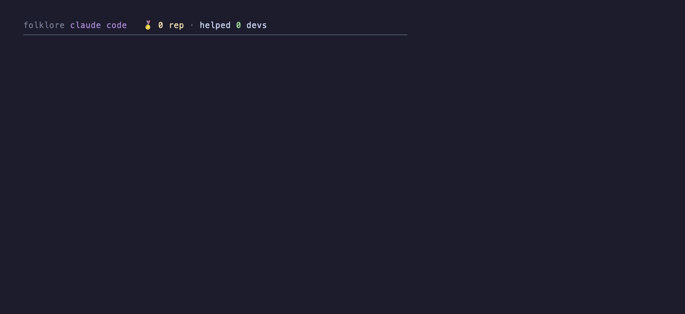

# In-session demo

Folklore where it actually lives — **inside a Claude Code session**. Your agent
hits a question, folklore answers it from the swarm instead of the web, and your
node earns reputation serving its traces back to other agents. Both directions,
live, in the one surface you already work in.



- **Receiving** — the agent reaches for `WebSearch`; folklore's PreToolUse hook
  intercepts, finds two peers already ground this out, and **denies the web
  call**, injecting their signed traces. Zero web, zero re-inference.
- **Serving** — meanwhile the status bar climbs: `🏅 1 → 2 → 3 rep`, flashing
  `⚡ answered <peer>` as other agents pull *your* traces. You paid for that
  inference once; the swarm reuses it, and answering pushes your reputation up.

## Nothing here is faked

The `./resolve`-style wrapper demos are gone — nobody works that way. This one
replays **real folklore output**: `capture.sh` stands up a real node, drives
real peer serves, and records the actual PreToolUse hook decision
(`.frames/hook.json`) and the actual statusline at each serve
(`.frames/status-N.txt`). `session.mjs` frames those real outputs into the
Claude Code TUI. The deny, the signed traces, the reputation, the notifications
— all produced by the running daemon, not scripted.

## Re-record

```bash
cd examples/in-session
bash capture.sh     # stand up a node, drive real serves, capture real outputs
vhs demo.tape       # replay them as the session → in-session.gif
```

Requires [`vhs`](https://github.com/charmbracelet/vhs) (`brew install vhs`).

## Files

| File | Role |
| --- | --- |
| `capture.sh` | stands up a real node + peers, captures the real hook + statusline frames |
| `session.mjs` | replays the captured real outputs as a Claude Code TUI session |
| `demo.tape` | VHS script that records the GIF |
