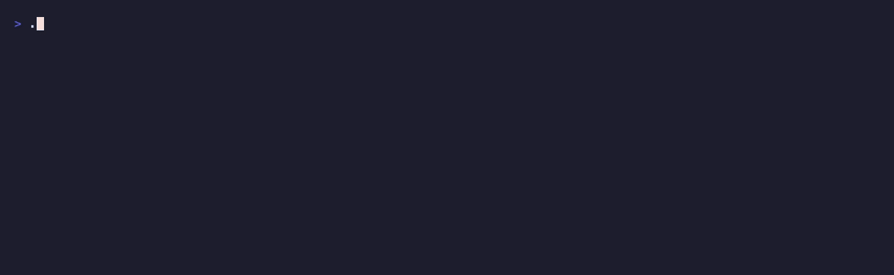

# Live feed — peers pulling from your tree, in real time

Proof the network is alive. Every time another peer fetches or searches your
graph, `folklore live` prints it as it happens:



```
⬅  @sam-rs     pulled  tokio-rc-send-across-await  from your tree  · just now
⬅  @tia-async  pulled  axum-extractor-order        from your tree  · just now
⬅  @leo-k      pulled  sqlx-offline-prepare        from your tree  · just now
```

Labeled peers resolve to `@handle` (via `folklore peer label`); others show
`peer:12D3Ko…`. The node name is the actual trace pulled from your tree.

## Run it

```bash
folklore live            # tails your node's real serve traffic until Ctrl-C
folklore live --tail=20  # seed with the last 20 events first
```

It reads `~/.folklore/served-feed.jsonl`, which the daemon's fetch + search
responders append to on every peer request — so it reflects real traffic off
your running node, live.

## About this recording

The gif is honest, not synthesised: three real peer nodes (`@sam-rs`,
`@tia-async`, `@leo-k`) genuinely pulled three traces from the node's tree — the
peer ids, node ids, and request kinds are exactly what the daemon recorded.
Because an ephemeral peer pull takes several seconds to complete, `record.sh`
captures those real events off-camera and replays them into the feed at a
visible pace while recording, so the streaming is legible. Nothing is invented;
only the arrival timing is paced.

## Files

| File | Role |
| --- | --- |
| `record.sh` | stands up your node + three real peers, generates real pulls, records the feed |
| `demo.tape` | VHS script that records `folklore live` |
